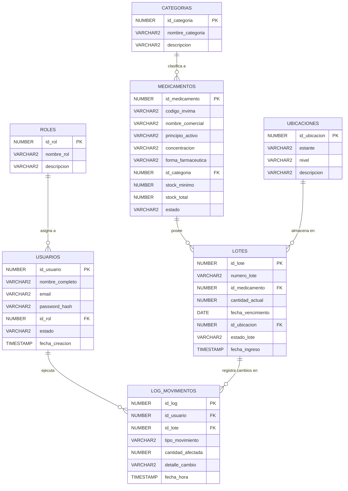

# 🗄️ Documentación de Base de Datos - CareStock

La persistencia de datos del sistema **CareStock** está estructurada en **PostgreSQL / NeonDB**. A continuación se detalla la configuración de la base de datos, los scripts de prueba resilientes y las consultas para el monitoreo de alertas de inventario.

---

## 📁 Estructura de Archivos SQL

Todos los scripts relacionados con la base de datos se encuentran organizados dentro del directorio `DOCS/database/`:

* **`DOCS/database/seed_carestock.sql`**: Script de inserción de datos de prueba (Seed Data).
* **`DOCS/database/queries_reportes.sql`**: Consultas analíticas y de generación de alertas.

---

## Diagrama Entidad-Relacion Base de datos



## 🌱 Script de Carga Inicial (Seed Data)

El script `DOCS/database/seed_carestock.sql` utiliza cláusulas `ON CONFLICT` para garantizar la idempotencia de las inserciones y evitar errores por registros duplicados al ejecutar múltiples pruebas.

```sql
-- ========================================================
-- CareStock Database - Datos de Prueba Resilientes (Seed)
-- ========================================================

-- 1. ROLES
INSERT INTO ROLES (nombre_rol, descripcion) VALUES
('ADMINISTRADOR', 'Acceso total al sistema'),
('FARMACEUTICO', 'Gestión de medicamentos, lotes y movimientos')
ON CONFLICT (nombre_rol) DO NOTHING;

-- 2. CATEGORIAS
INSERT INTO CATEGORIAS (nombre_categoria, descripcion) VALUES
('ANALGESICOS', 'Medicamentos para aliviar el dolor'),
('ANTIBIOTICOS', 'Tratamiento de infecciones bacterianas'),
('CARDIOVASCULAR', 'Control de presión y corazón')
ON CONFLICT (nombre_categoria) DO NOTHING;

-- 3. UBICACIONES
INSERT INTO UBICACIONES (estante, nivel, descripcion) VALUES
('A-01', 'N1', 'Pasillo principal - Alta rotación'),
('B-02', 'N2', 'Almacenamiento en frío')
ON CONFLICT (estante, nivel) DO NOTHING;

-- 4. USUARIOS
INSERT INTO USUARIOS (nombre_completo, email, password_hash, id_rol)
VALUES (
    'Admin CareStock', 
    'admin@carestock.com', 
    '$2a$12$eImiTXuWVxfM37uY4JANjO...hash', 
    (SELECT id_rol FROM ROLES WHERE nombre_rol = 'ADMINISTRADOR')
)
ON CONFLICT (email) DO NOTHING;

-- 5. MEDICAMENTOS
INSERT INTO MEDICAMENTOS (
    codigo_invima, nombre_comercial, principio_activo, 
    concentracion, forma_farmaceutica, id_categoria, 
    stock_minimo, stock_total, estado
)
VALUES 
(
    'INVIMA-2024M-001', 'Acetaminofén 500mg', 'Paracetamol', 
    '500 mg', 'Tabletas', 
    (SELECT id_categoria FROM CATEGORIAS WHERE nombre_categoria = 'ANALGESICOS' LIMIT 1), 
    100, 20, 'ACTIVO'
),
(
    'INVIMA-2024M-002', 'Amoxicilina 500mg', 'Amoxicilina', 
    '500 mg', 'Cápsulas', 
    (SELECT id_categoria FROM CATEGORIAS WHERE nombre_categoria = 'ANTIBIOTICOS' LIMIT 1), 
    50, 150, 'ACTIVO'
)
ON CONFLICT (codigo_invima) DO UPDATE 
SET stock_total = EXCLUDED.stock_total,
    stock_minimo = EXCLUDED.stock_minimo,
    estado = EXCLUDED.estado;

-- 6. LOTES
INSERT INTO LOTES (numero_lote, id_medicamento, cantidad_actual, fecha_vencimiento, id_ubicacion)
VALUES 
(
    'LOT-2026-001', 
    (SELECT id_medicamento FROM MEDICAMENTOS WHERE codigo_invima = 'INVIMA-2024M-001'), 
    20, CURRENT_DATE + INTERVAL '15 days', 
    (SELECT id_ubicacion FROM UBICACIONES WHERE estante = 'A-01' AND nivel = 'N1')
),
(
    'LOT-2026-002', 
    (SELECT id_medicamento FROM MEDICAMENTOS WHERE codigo_invima = 'INVIMA-2024M-002'), 
    150, '2027-12-31', 
    (SELECT id_ubicacion FROM UBICACIONES WHERE estante = 'B-02' AND nivel = 'N2')
)
ON CONFLICT (numero_lote, id_medicamento) DO NOTHING;
