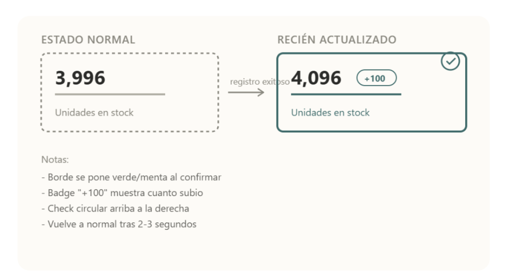
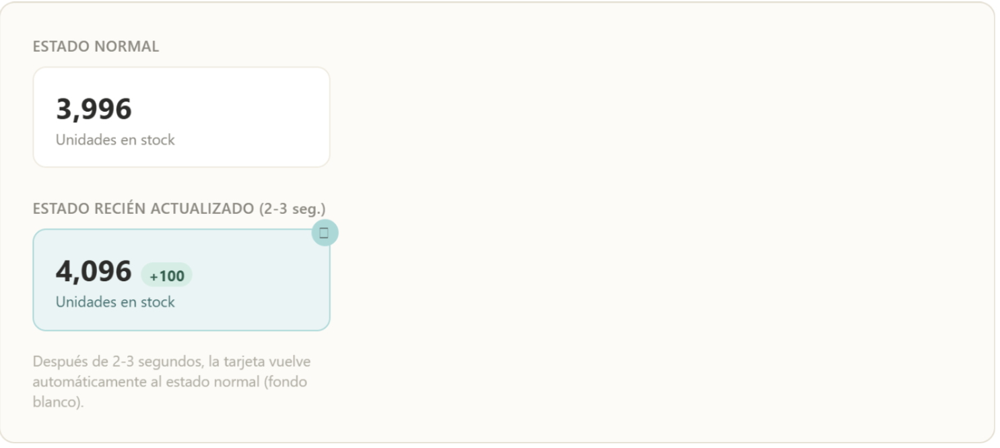

## Confirmación Visual de Stock Actualizado (HU-55)

### Comportamiento
Al registrar un lote exitosamente, la tarjeta "Unidades en stock" del dashboard muestra un resaltado temporal (2-3 segundos) para confirmar visualmente que el número cambió.

### Estado visual
| Estado | Fondo de la tarjeta | Duración |
|---|---|---|
| Normal | Blanco (#FFFFFF) | — |
| Recién actualizado | Menta claro (#E9F4F4) con borde #A7D8D8 | 2-3 segundos |

### Regla
Se activa únicamente después de un registro exitoso de lote, nunca al solo abrir o refrescar el dashboard.

