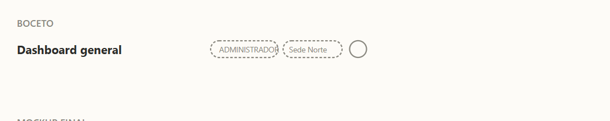
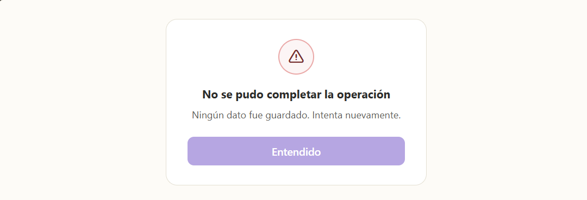

## Badge de Farmacia Activa (HU-62)

### Comportamiento
Junto al badge de rol (menta/durazno) del dashboard, se muestra un segundo badge con el nombre de la farmacia a la que pertenece la sesión activa.

### Estado visual
| Elemento | Color |
|---|---|
| Badge de farmacia | Fondo lavanda claro (#EDE7F6), texto #5B4E8C |

