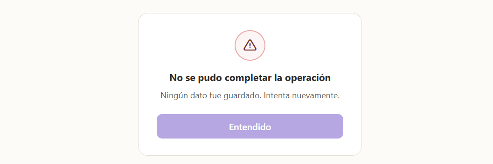

## Mensaje de Error — Operación Revertida (HU-63)

### Texto oficial
"No se pudo completar la operación. Ningún dato fue guardado, intenta nuevamente."

### Cuándo se usa
En cualquier operación crítica de varios pasos (ej. registrar lote + actualizar stock + registrar trazabilidad) donde, si un paso falla, el sistema debe deshacer todo para no dejar información a medias.

### Estilo
Reutiliza el estilo de error coral (#F0A8A8) ya definido en HU-43.

