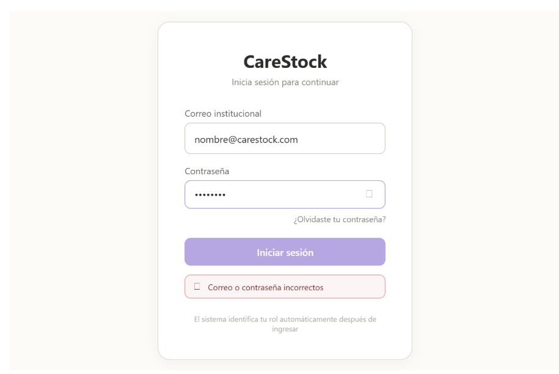
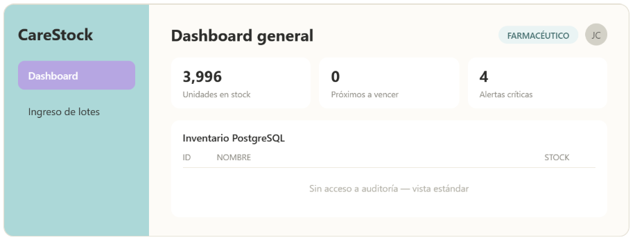
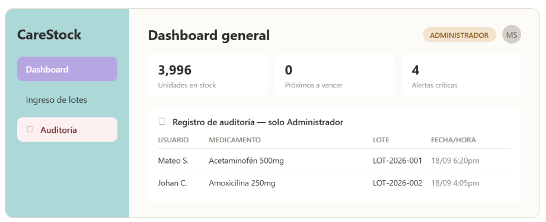

## Diferenciación Visual por Rol (HU-56)

### Login único
Una sola pantalla de inicio de sesión para todos los roles. El sistema determina el rol después de autenticar.

### Vista Farmacéutico
Dashboard operativo estándar. Etiqueta de rol: fondo menta claro (#E9F4F4), texto "AUXILIAR_FARMACIA".

### Vista Administrador
Todo lo del Farmacéutico, más la sección "Registro de auditoría". Etiqueta de rol: fondo durazno claro (#F6E3D0), texto "ADMINISTRADOR".

### Tabla comparativa
| Elemento | Farmacéutico | Administrador |
|---|---|---|
| Dashboard general | ✅ | ✅ |
| Registrar ingreso de lote | ✅ | ✅ |
| Ver alertas críticas | ✅ | ✅ |
| Registro de auditoría | ❌ | ✅ |
