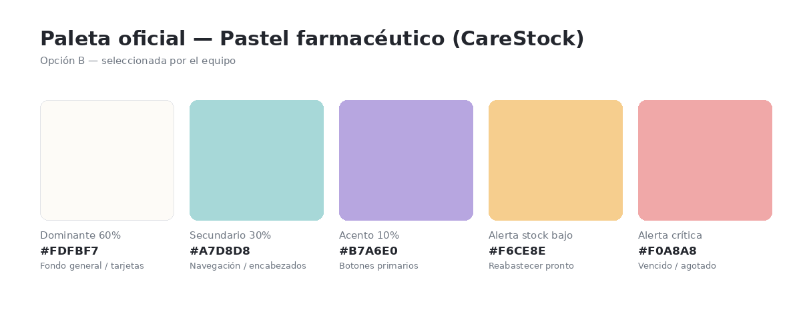
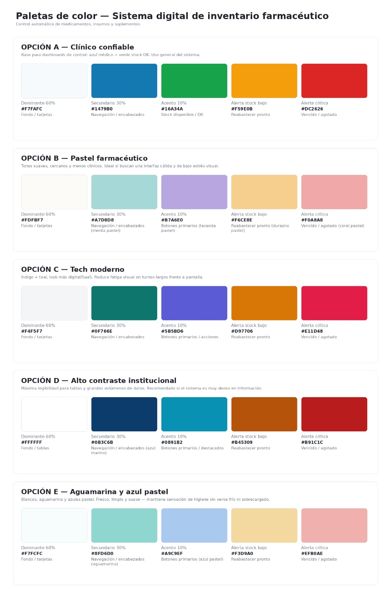
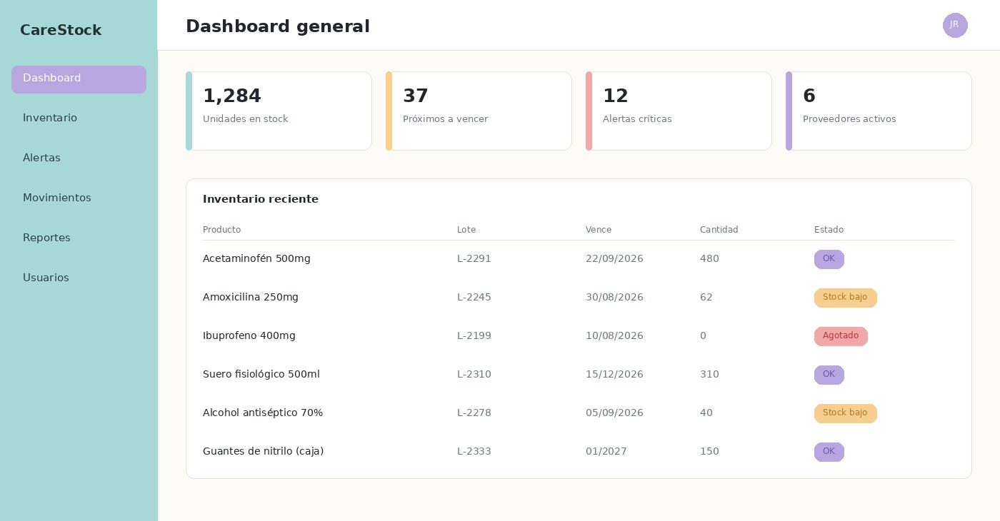

# Documentación de Interfaz Gráfica y Diseño UI - CareStock

Este documento consolida la definición del sistema de diseño, paleta cromática e interfaz de usuario para el sistema **CareStock**.

## 1. Paleta de Colores Oficial

Luego del proceso de evaluación, se seleccionó la **Opción B — Pastel farmacéutico** por sus tonos suaves que reducen el estrés visual y facilitan el uso prolongado en entornos de salud.

### Especificación Cromática

| Rol | Código Hex | Color / Tono | Uso en la Interfaz |
| :--- | :--- | :--- | :--- |
| **Dominante (60%)** | `#FDFBF7` | Marfil suave | Fondo general de la interfaz y tarjetas contenedoras |
| **Secundario (30%)** | `#A7D8D8` | Menta pastel | Navegación, encabezados y barra lateral izquierda |
| **Acento (10%)** | `#B7A6E0` | Lavanda pastel | Botones primarios, elementos activos y acciones principales |
| **Alerta - Stock bajo** | `#F6CE8E` | Durazno pastel | Indicadores de reabastecimiento próximo |
| **Alerta - Crítico** | `#F0A8A8` | Coral pastel | Medicamentos vencidos, agotados o alertas críticas |

---

## 2. Alternativas Evaluadas

Se diseñaron e integraron en la encuesta de decisión 5 alternativas de diseño para el sistema de inventario:

* **Opción A:** Clínico confiable (Azul médico + Verde OK).
* **Opción B:** Pastel farmacéutico *(Seleccionada por el equipo)*.
* **Opción C:** Tech moderno (Índigo + Teal).
* **Opción D:** Alto contraste institucional.
* **Opción E:** Aguamarina y azul pastel.

---

## 3. Prototipo de Interfaz (Dashboard General)

Vista previa del panel principal aplicando el sistema de diseño y paleta oficial seleccionada:

