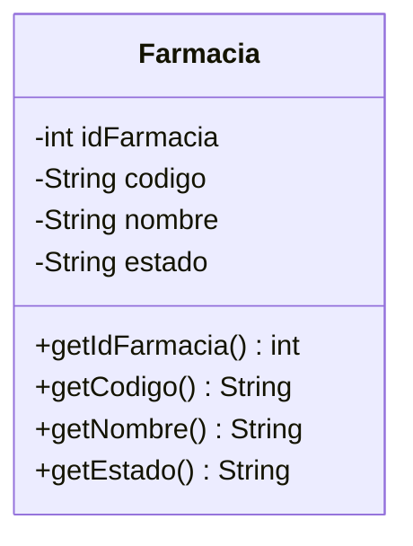
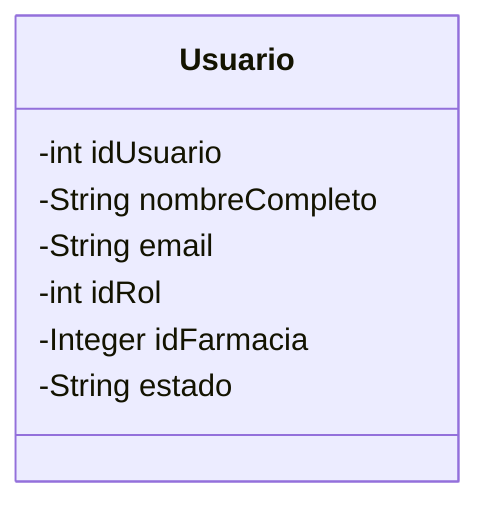
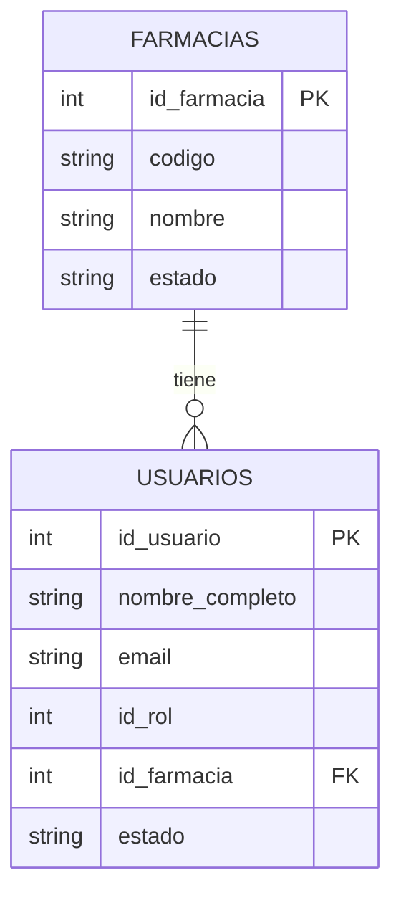
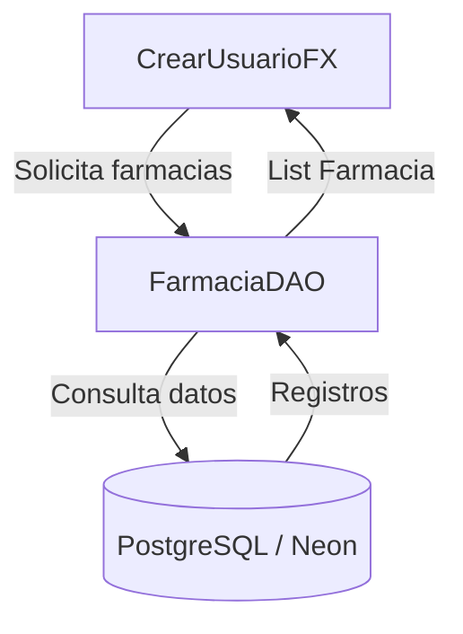
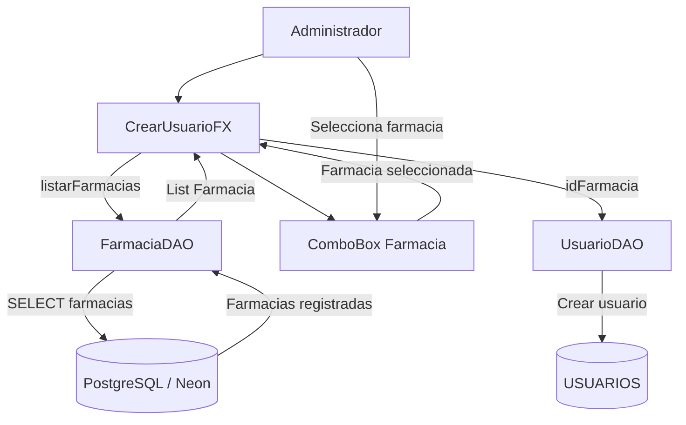
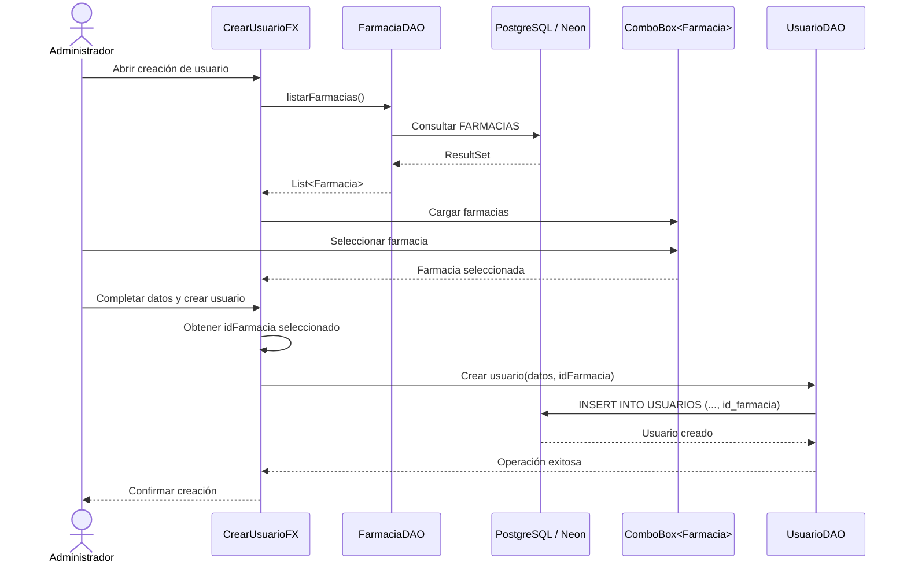

# Issue #503 — Documentar carga dinámica y asignación usuario-farmacia

## 1. Objetivo

Documentar la implementación asociada a la carga dinámica de farmacias durante la creación de usuarios y la asignación de una farmacia al usuario creado.

La funcionalidad permite que un **Administrador** seleccione una farmacia existente desde la interfaz de creación de usuarios, evitando el ingreso manual del identificador de farmacia y garantizando que la relación entre usuario y farmacia corresponda con información existente en la base de datos.

Esta documentación complementa la implementación técnica, el Definition of Done (DoD) y el Registro de Diseños de Software de CareStock.

---

# 2. Contexto funcional

CareStock soporta múltiples farmacias. Por este motivo, los usuarios que realizan operaciones dentro del sistema deben quedar asociados a una farmacia determinada.

Anteriormente, la asignación de la farmacia podía depender de valores ingresados manualmente o de lógica poco visible para el usuario.

La mejora implementada permite:

- Consultar dinámicamente las farmacias registradas.
- Mostrar las farmacias disponibles en un `ComboBox`.
- Permitir que el Administrador seleccione una farmacia.
- Obtener el identificador correspondiente a la farmacia seleccionada.
- Asignar dicho identificador al usuario.
- Persistir la relación mediante `USUARIOS.id_farmacia`.
- Evitar que la interfaz JavaFX contenga consultas SQL directamente.

---

# 3. Diseño Basado en Modelos — MBD

## 3.1 Modelo Farmacia

La entidad `Farmacia` representa una sede o farmacia registrada dentro de CareStock.

Conceptualmente contiene información como:

- `idFarmacia`
- `codigo`
- `nombre`
- `estado`

El identificador de la farmacia es utilizado como referencia desde otras entidades del sistema, particularmente desde `Usuario`.



---

## 3.2 Modelo Usuario

La entidad `Usuario` representa una persona autorizada para utilizar CareStock.

Entre sus datos se encuentra la referencia a la farmacia a la cual pertenece.



---

## 3.3 Relación Usuario–Farmacia

Una farmacia puede tener múltiples usuarios asociados, mientras que cada usuario operativo pertenece a una farmacia determinada.

La relación corresponde a:

**FARMACIAS 1:N USUARIOS**



La clave:

```text
USUARIOS.id_farmacia
```

referencia:

```text
FARMACIAS.id_farmacia
```

De esta forma, CareStock puede identificar el contexto de farmacia correspondiente a cada usuario.

---

# 4. Diseño estructural

La funcionalidad se distribuye entre la interfaz JavaFX, los objetos de acceso a datos y PostgreSQL.

La estructura principal es:



`CrearUsuarioFX` no consulta directamente la base de datos.

La responsabilidad de obtener las farmacias se encuentra encapsulada en `FarmaciaDAO`.

---

## 4.1 Estructura completa de creación del usuario



---

# 5. Diseño de comportamiento

## 5.1 Flujo general

El comportamiento esperado es:

1. El Administrador abre la pantalla de creación de usuarios.
2. `CrearUsuarioFX` solicita las farmacias disponibles.
3. `FarmaciaDAO` consulta PostgreSQL.
4. PostgreSQL devuelve las farmacias registradas.
5. `FarmaciaDAO` convierte los registros en objetos `Farmacia`.
6. La interfaz recibe una `List<Farmacia>`.
7. Las farmacias son cargadas en el `ComboBox`.
8. El Administrador selecciona una farmacia.
9. La interfaz obtiene el identificador de la farmacia seleccionada.
10. Los datos del nuevo usuario son enviados a `UsuarioDAO`.
11. `UsuarioDAO` persiste el usuario junto con `id_farmacia`.
12. La relación queda almacenada en la tabla `USUARIOS`.

---

## 5.2 Diagrama de secuencia



---

# 6. Separación de responsabilidades

## CrearUsuarioFX

Responsable de:

- Presentar el formulario.
- Solicitar la carga de farmacias.
- Mostrar las farmacias en el `ComboBox`.
- Capturar la selección del Administrador.
- Validar los datos de entrada.
- Coordinar la creación del usuario.

No debe contener consultas SQL.

---

## FarmaciaDAO

Responsable de:

- Acceder a la información relacionada con farmacias.
- Ejecutar las consultas SQL necesarias.
- Convertir registros de PostgreSQL en objetos `Farmacia`.
- Retornar colecciones de farmacias a las capas superiores.

Ejemplo conceptual:

```java
List<Farmacia> listarFarmacias();
```

---

## UsuarioDAO

Responsable de:

- Persistir usuarios.
- Asociar el usuario con su rol.
- Asociar el usuario con una farmacia.
- Ejecutar las operaciones SQL correspondientes a `USUARIOS`.

La asociación se realiza utilizando:

```text
USUARIOS.id_farmacia
```

---

# 7. Patrones de diseño y principios aplicados

## 7.1 DAO — Data Access Object

CareStock utiliza el patrón DAO para separar el acceso a la base de datos del resto de la aplicación.

En esta funcionalidad intervienen principalmente:

- `FarmaciaDAO`
- `UsuarioDAO`

Esto evita incorporar consultas SQL dentro de las clases JavaFX.

---

## 7.2 MVC / MV*

La aplicación JavaFX mantiene una separación conceptual entre:

- **Modelo:** `Farmacia`, `Usuario`.
- **Vista / interacción:** `CrearUsuarioFX`.
- **Acceso y coordinación con persistencia:** clases DAO y lógica asociada.

La implementación no corresponde necesariamente a un MVC estricto, pero mantiene una separación de responsabilidades compatible con una arquitectura MV*.

---

## 7.3 Single Responsibility Principle — SRP

Cada componente mantiene una responsabilidad específica.

`CrearUsuarioFX`:

```text
Interacción con el usuario
```

`FarmaciaDAO`:

```text
Persistencia y consulta de farmacias
```

`UsuarioDAO`:

```text
Persistencia de usuarios
```

Esto evita concentrar múltiples responsabilidades dentro de una única clase.

---

## 7.4 Separation of Concerns

La interfaz no necesita conocer cómo se construye una consulta SQL.

Por ejemplo:

```text
CrearUsuarioFX
      |
      v
FarmaciaDAO
      |
      v
PostgreSQL
```

La interacción con la base de datos se encuentra separada de la presentación.

---

## 7.5 Bajo acoplamiento

`CrearUsuarioFX` depende de una operación de alto nivel:

```java
listarFarmacias()
```

y no de la implementación específica de la consulta SQL.

Esto reduce el acoplamiento entre la interfaz y PostgreSQL.

---

## 7.6 Alta cohesión

Las operaciones relacionadas con farmacias permanecen agrupadas dentro de `FarmaciaDAO`.

Las operaciones relacionadas con usuarios permanecen dentro de `UsuarioDAO`.

Esto permite que cada componente concentre comportamiento relacionado con su responsabilidad principal.

---

# 8. Principios GRASP

## 8.1 Information Expert

`FarmaciaDAO` actúa como experto en la obtención de información persistida sobre farmacias.

Por ello, la operación:

```java
listarFarmacias()
```

debe pertenecer al componente encargado del acceso a datos de farmacia y no a la interfaz.

---

## 8.2 Controller

`CrearUsuarioFX` recibe las acciones iniciadas por el Administrador y coordina el flujo de creación del usuario.

Conceptualmente:

```text
Administrador
      |
      v
CrearUsuarioFX
      |
      +----> FarmaciaDAO
      |
      +----> UsuarioDAO
```

La interfaz actúa como coordinador de la interacción, pero delega el acceso a persistencia en los DAO.

---

## 8.3 Low Coupling

La interacción mediante DAO evita que:

```text
CrearUsuarioFX
```

dependa directamente de:

```text
Connection
PreparedStatement
ResultSet
SQL
```

---

## 8.4 High Cohesion

Las responsabilidades permanecen distribuidas en componentes especializados:

```text
CrearUsuarioFX -> interacción
FarmaciaDAO    -> farmacias
UsuarioDAO     -> usuarios
```

---

# 9. Registro de Diseños de Software

## 9.1 4.1 Diseño Basado en Modelos

Se documentan los modelos:

- `Farmacia`.
- `Usuario`.

Además, se establece la relación:

```text
FARMACIAS 1:N USUARIOS
```

mediante:

```text
USUARIOS.id_farmacia
```

---

## 9.2 4.2 Descripción de diseño estructural

Se documenta la estructura:

```text
CrearUsuarioFX
      |
      v
FarmaciaDAO
      |
      v
PostgreSQL / Neon
```

y para la persistencia:

```text
CrearUsuarioFX
      |
      v
UsuarioDAO
      |
      v
USUARIOS
```

También se documenta la relación estructural entre `Farmacia` y `Usuario`.

---

## 9.3 4.3 Descripción de comportamiento

Se documenta mediante un diagrama de secuencia el flujo:

```text
Administrador
    ↓
CrearUsuarioFX
    ↓
FarmaciaDAO.listarFarmacias()
    ↓
PostgreSQL
    ↓
List<Farmacia>
    ↓
ComboBox
    ↓
Seleccionar farmacia
    ↓
Crear usuario
    ↓
UsuarioDAO
    ↓
USUARIOS.id_farmacia
```

---

## 9.4 4.4 Patrones y estilos de diseño

Se identifican:

- DAO.
- MVC / MV*.
- SRP.
- Separation of Concerns.
- Bajo acoplamiento.
- Alta cohesión.
- GRASP Information Expert.
- GRASP Controller.
- GRASP Low Coupling.
- GRASP High Cohesion.

---

# 10. Validaciones consideradas

La creación del usuario debe contemplar como mínimo:

- Existencia de farmacias disponibles.
- Selección obligatoria de farmacia cuando el rol requiera contexto de sede.
- Uso del identificador de la farmacia seleccionada.
- No permitir ingresar manualmente un `id_farmacia` arbitrario.
- Persistir correctamente la relación.
- Mostrar un mensaje de error cuando la operación de consulta o persistencia falle.

---

# 11. Beneficios de la implementación

La carga dinámica de farmacias permite:

- Reducir errores de asignación.
- Evitar identificadores ingresados manualmente.
- Mantener integridad referencial.
- Mejorar la experiencia del usuario.
- Facilitar el soporte de múltiples farmacias.
- Preparar CareStock para la segregación de información por sede.
- Mantener la lógica de persistencia fuera de la interfaz.
- Mejorar mantenibilidad y extensibilidad.

---

# 12. Definition of Done — DoD

Para considerar completada la Issue #503 se verifica:

- [x] Se documentó el modelo `Farmacia`.
- [x] Se documentó el modelo `Usuario`.
- [x] Se documentó la relación `FARMACIAS 1:N USUARIOS`.
- [x] Se documentó `USUARIOS.id_farmacia`.
- [x] Se documentó la carga dinámica de farmacias.
- [x] Se documentó `FarmaciaDAO.listarFarmacias()`.
- [x] Se documentó el flujo de selección mediante `ComboBox`.
- [x] Se documentó la persistencia mediante `UsuarioDAO`.
- [x] Se agregó el diseño estructural.
- [x] Se agregó el diseño de comportamiento.
- [x] Se agregó el Diseño Basado en Modelos.
- [x] Se documentaron los patrones de diseño.
- [x] Se documentaron principios SOLID aplicables.
- [x] Se documentaron principios GRASP aplicables.
- [x] Se documentó bajo acoplamiento y alta cohesión.
- [x] La documentación es consistente con la arquitectura actual de CareStock.

---

# 13. Conclusión

La carga dinámica de farmacias durante la creación de usuarios permite mantener una asociación explícita entre cada usuario y su sede correspondiente.

La solución aprovecha los modelos `Usuario` y `Farmacia`, delega el acceso a persistencia en `FarmaciaDAO` y `UsuarioDAO`, y mantiene la interfaz `CrearUsuarioFX` desacoplada de las consultas SQL.

Esta estructura contribuye directamente al soporte multi-farmacia de CareStock y establece la base para funcionalidades posteriores de segregación de inventario, operaciones y permisos según la farmacia asignada al usuario.