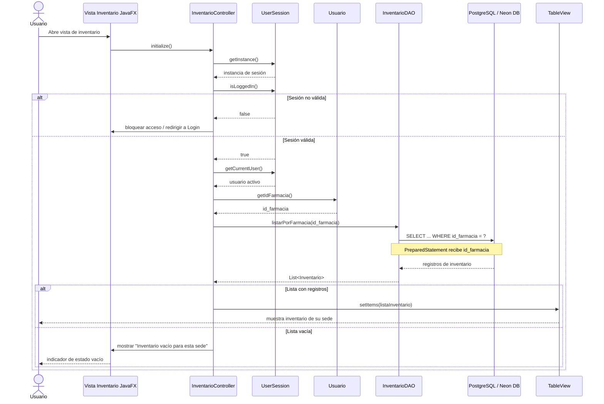

# HU-67 - Diseño de Comportamiento

## Filtrar el listado de inventario por la farmacia del usuario activo

**Issue de diseño:** #450  
**Historia de Usuario:** HU-67

## 1. Objetivo

Documentar el comportamiento del sistema durante la carga de la vista de
inventario, asegurando que los registros consultados correspondan
exclusivamente a la farmacia asociada al usuario autenticado.

El identificador de farmacia debe obtenerse automáticamente desde el contexto
de sesión y propagarse hasta la capa de persistencia.

---

## 2. Diagrama de Secuencia

El siguiente diagrama representa el comportamiento esperado desde la carga de
la vista JavaFX hasta la actualización del TableView.



---

## 3. Flujo de comportamiento

El comportamiento esperado de HU-67 sigue la siguiente secuencia:

1. El usuario accede a la vista de inventario.
2. JavaFX ejecuta automáticamente la inicialización del controlador.
3. El controlador verifica que exista una sesión autenticada.
4. El controlador obtiene el usuario activo desde `UserSession`.
5. Del usuario activo se obtiene el identificador de farmacia.
6. El controlador pasa `id_farmacia` al método correspondiente de la capa DAO.
7. El DAO construye una consulta JDBC parametrizada.
8. PostgreSQL retorna únicamente el inventario asociado a dicha farmacia.
9. El DAO transforma los resultados en objetos del modelo.
10. El controlador actualiza el `TableView`.
11. Si no existen registros, se muestra el mensaje:
    `Inventario vacío para esta sede`.

---

## 4. Pseudocódigo

```text
AL CARGAR LA VISTA DE INVENTARIO

    session = obtener instancia de UserSession

    SI session no existe O session no tiene usuario autenticado
        bloquear acceso a inventario
        redirigir a pantalla de inicio de sesión
        TERMINAR
    FIN SI

    usuarioActivo = session.obtenerUsuarioActual()

    idFarmacia = usuarioActivo.obtenerIdFarmacia()

    SI idFarmacia es nulo O inválido
        limpiar TableView
        mostrar mensaje de error de contexto de farmacia
        TERMINAR
    FIN SI

    INTENTAR

        listaInventario =
            InventarioDAO.listarPorFarmacia(idFarmacia)

        SI listaInventario está vacía

            limpiar TableView

            mostrar:
            "Inventario vacío para esta sede"

        SINO

            cargar listaInventario en TableView

        FIN SI

    CAPTURAR error de persistencia

        limpiar TableView

        mostrar mensaje controlado de error al consultar inventario

        registrar error técnico

    FIN INTENTAR
```

---

## 5. Pseudocódigo de Persistencia

```text
FUNCIÓN listarPorFarmacia(idFarmacia)

    validar que idFarmacia sea válido

    consulta =
        SELECT ...
        FROM ...
        WHERE id_farmacia = ?

    abrir conexión JDBC

    preparar PreparedStatement

    asignar:
        parámetro 1 = idFarmacia

    ejecutar consulta

    crear listaInventario vacía

    MIENTRAS existan resultados

        crear objeto Inventario

        mapear columnas del ResultSet al objeto Inventario

        agregar objeto a listaInventario

    FIN MIENTRAS

    cerrar recursos JDBC

    retornar listaInventario
FIN FUNCIÓN
```

---

## 6. Inyección del contexto de farmacia

El identificador de farmacia debe provenir exclusivamente de la sesión del
usuario autenticado.

Flujo permitido:

```text
UserSession
    ↓
Usuario activo
    ↓
id_farmacia
    ↓
Controller
    ↓
DAO
    ↓
PreparedStatement
```

No se permite obtener el identificador de farmacia mediante una selección
manual realizada desde la interfaz.

Por lo tanto, la lógica no debe depender de componentes como:

```text
ComboBox<Farmercia>
ChoiceBox<Farmacia>
TextField idFarmacia
```

para determinar qué inventario consultar.

---

## 7. Consulta parametrizada

La capa de persistencia debe utilizar una consulta JDBC parametrizada.

Conceptualmente:

```sql
SELECT ...
FROM ...
WHERE id_farmacia = ?
```

El parámetro deberá asignarse mediante un `PreparedStatement`.

Ejemplo conceptual:

```java
preparedStatement.setLong(1, idFarmacia);
```

La consulta no debe recuperar el inventario completo para posteriormente
filtrarlo en memoria.

---

## 8. Estado vacío

Cuando la consulta retorne cero registros, el sistema deberá conservar la vista
operativa y mostrar el indicador:

```text
Inventario vacío para esta sede
```

El resultado vacío es un estado válido del sistema y no debe ser tratado como
una excepción.

---

## 9. Manejo de excepciones

Deben diferenciarse los siguientes escenarios:

### Sesión no válida

No debe ejecutarse ninguna consulta de inventario.

### Usuario sin farmacia asociada

No debe realizarse una consulta global ni utilizar una farmacia por defecto.

### Inventario vacío

Debe mostrarse:

```text
Inventario vacío para esta sede
```

### Error JDBC / conexión

Debe manejarse como una excepción técnica y mostrarse al usuario un mensaje
controlado, sin exponer credenciales, SQL interno ni detalles sensibles de la
base de datos.

---

## 10. Relación con Registro de Diseños de Software

Este documento da cumplimiento al numeral:

**4.3 Descripciones de Diseño de Comportamiento**

mediante:

- diagrama de secuencia;
- descripción del flujo de interacción;
- pseudocódigo del controlador;
- pseudocódigo de persistencia;
- comportamiento frente a una sesión inválida;
- comportamiento frente a inventario vacío;
- comportamiento frente a errores de persistencia.

El documento deberá actualizarse si durante la implementación se modifican las
responsabilidades, métodos o componentes representados.