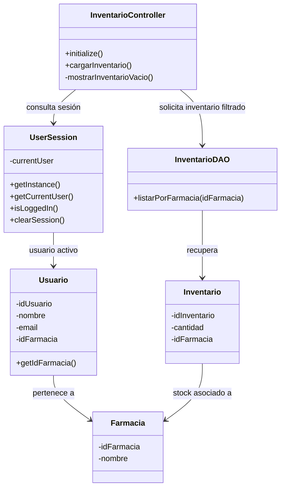
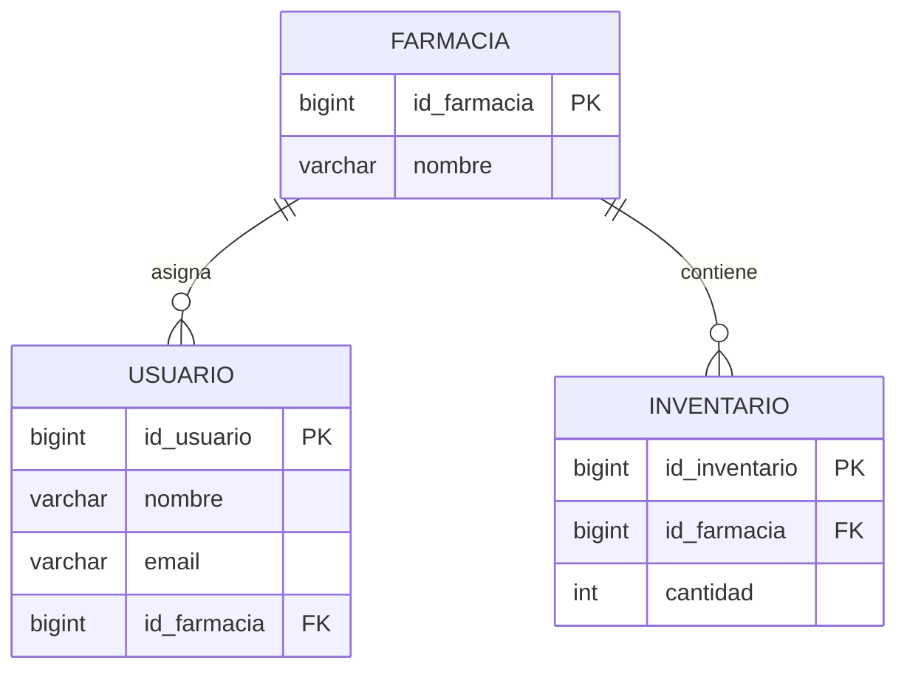

# HU-67 - Diseño Estructural

## Filtrar el listado de inventario por la farmacia del usuario activo

**Issue de diseño:** #449  
**Historia de Usuario:** HU-67

## 1. Objetivo

Documentar la estructura de software involucrada en el filtrado del inventario
según la farmacia asociada al usuario autenticado.

La solución debe garantizar que el contexto de farmacia sea obtenido a partir
de la sesión activa y utilizado por la capa de persistencia para limitar los
registros recuperados desde la base de datos.

---

## 2. Diagrama de Clases

El diseño relaciona la vista/controlador de inventario con el contexto de
sesión y la capa de acceso a datos.



### Responsabilidades

**InventarioController**

Responsable de inicializar la vista de inventario y solicitar los registros
correspondientes a la farmacia del usuario activo.

**UserSession**

Mantiene el contexto de autenticación durante la ejecución de la aplicación.

**Usuario**

Representa al usuario autenticado y permite identificar la farmacia o sede
asociada.

**InventarioDAO**

Responsable del acceso a PostgreSQL mediante JDBC. Recibe el identificador de
la farmacia y ejecuta la consulta de inventario correspondiente.

**Farmacia**

Representa la sede a la cual se encuentra asociado el usuario y el inventario.

---

## 3. Flujo estructural

La dependencia esperada para HU-67 es:

```text
JavaFX / TableView
        |
        v
InventarioController
        |
        +------> UserSession
        |            |
        |            v
        |          Usuario
        |            |
        |         id_farmacia
        |
        v
InventarioDAO
        |
        v
PostgreSQL / Neon
```

El identificador de farmacia no debe ser seleccionado manualmente por el
usuario desde la interfaz.

Debe ser obtenido exclusivamente desde el contexto de sesión autenticado.

---

## 4. Diagrama de Relación de Entidades

El modelo de datos debe permitir relacionar el inventario con la farmacia
correspondiente.



> Nota: los nombres de tablas, atributos y relaciones deberán corresponder al
> modelo físico actualmente implementado en PostgreSQL/Neon. Este diagrama
> representa exclusivamente las entidades relevantes para HU-67.

---

## 5. Restricción estructural de HU-67

La arquitectura debe garantizar la siguiente cadena de propagación del
contexto:

```text
Usuario autenticado
        ↓
UserSession
        ↓
id_farmacia
        ↓
InventarioController
        ↓
InventarioDAO
        ↓
PreparedStatement
        ↓
PostgreSQL
```

La capa de persistencia deberá recibir obligatoriamente el identificador de
farmacia.

Conceptualmente, la consulta deberá cumplir la siguiente condición:

```sql
WHERE id_farmacia = ?
```

El valor del parámetro deberá provenir del contexto de sesión y no de una
selección manual realizada desde la interfaz.

---

## 6. Relación con el Registro de Diseños de Software

Este artefacto da cumplimiento al numeral **4.2 - Descripciones de Diseño
Estructural**, mediante:

- actualización del diagrama de clases;
- representación de las dependencias entre sesión, controlador y DAO;
- verificación de la relación entre usuario, inventario y farmacia;
- representación mediante ERD de las entidades relevantes para HU-67.

La documentación será actualizada nuevamente si durante la implementación se
identifican diferencias entre el diseño propuesto y el modelo físico definitivo.