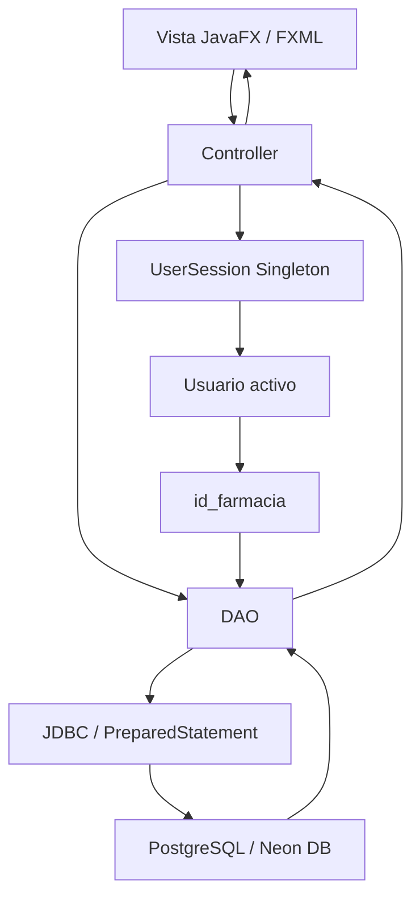

# HU-67 - Patrones y Estilos de Diseño

## Filtrar el listado de inventario por la farmacia del usuario activo

**Issue de diseño:** #451  
**Historia de Usuario:** HU-67

## 1. Objetivo

Documentar los patrones y estilos de diseño utilizados para implementar el
filtrado del inventario según la farmacia asociada al usuario autenticado.

La solución reutiliza mecanismos arquitectónicos existentes en CareStock para
mantener el contexto de sesión, separar responsabilidades entre interfaz,
lógica de aplicación y persistencia, y evitar el acoplamiento directo entre
JavaFX y PostgreSQL.

---

## 2. Patrón Singleton - Gestión de sesión

### Patrón utilizado

Para mantener y consultar el contexto del usuario autenticado se utiliza el
patrón creacional **Singleton**, implementado mediante `UserSession`.

El objetivo es mantener una única instancia de sesión disponible durante la
ejecución de la aplicación.

Conceptualmente:

```java
UserSession session = UserSession.getInstance();
```

La instancia contiene el contexto del usuario actualmente autenticado.

Para HU-67, dicho contexto permite obtener la farmacia asociada al usuario:

```text
UserSession
    ↓
Usuario activo
    ↓
id_farmacia
```

### Aplicación en HU-67

El controlador de inventario no debe solicitar al usuario que seleccione
manualmente una farmacia.

Debe obtener el contexto mediante la sesión activa:

```text
InventarioController
        ↓
UserSession.getInstance()
        ↓
getCurrentUser()
        ↓
id_farmacia
```

### Beneficios

- Existe una única fuente de contexto de sesión.
- Evita propagar manualmente el usuario entre todas las vistas.
- Reduce inconsistencias entre diferentes pantallas.
- Permite identificar automáticamente la farmacia del usuario activo.
- Facilita la protección de operaciones dependientes de autenticación.

### Consideración

El Singleton no debe convertirse en una fuente global de datos arbitrarios.

Su responsabilidad debe limitarse al contexto de autenticación y sesión.

---

## 3. Patrón DAO - Acceso a datos

### Patrón utilizado

CareStock utiliza el patrón **DAO (Data Access Object)** para encapsular la
interacción con PostgreSQL mediante JDBC.

La vista JavaFX y el controlador no deben ejecutar directamente sentencias SQL.

Conceptualmente:

```text
Controller
    ↓
DAO
    ↓
JDBC
    ↓
PostgreSQL / Neon DB
```

Para HU-67, el DAO recibirá el identificador de farmacia:

```text
listarPorFarmacia(idFarmacia)
```

y ejecutará una consulta parametrizada:

```sql
SELECT ...
FROM ...
WHERE id_farmacia = ?
```

### Responsabilidad del DAO

El DAO debe encargarse de:

- recibir `id_farmacia`;
- preparar la consulta JDBC;
- asignar el parámetro mediante `PreparedStatement`;
- ejecutar la consulta;
- mapear los registros del `ResultSet`;
- devolver la colección de inventario al controlador o capa superior.

### Beneficios

- Separa la lógica de persistencia de la interfaz gráfica.
- Reduce el acoplamiento entre JavaFX y PostgreSQL.
- Facilita pruebas y mantenimiento.
- Centraliza las consultas SQL.
- Evita duplicar lógica de acceso a datos.

---

## 4. MVC / Separación de responsabilidades

CareStock utiliza una separación de responsabilidades compatible con el estilo
arquitectónico **MVC (Model-View-Controller)**.

> MVC se documenta aquí como estilo/patrón arquitectónico y no como patrón
> estructural GoF.

Para HU-67 las responsabilidades se distribuyen de la siguiente manera:

### View

Corresponde a la interfaz JavaFX/FXML.

Responsabilidades:

- mostrar el `TableView`;
- mostrar los datos recibidos;
- mostrar el indicador de inventario vacío;
- capturar únicamente acciones de interfaz.

La vista no debe ejecutar consultas SQL ni decidir qué farmacia consultar.

---

### Controller

Responsabilidades:

- responder a la inicialización de la vista;
- consultar la sesión activa;
- obtener `id_farmacia`;
- solicitar el inventario correspondiente;
- actualizar el `TableView`;
- manejar estados de interfaz.

Flujo conceptual:

```text
Vista
  ↓
Controller
  ↓
UserSession
  ↓
DAO
```

---

### Model

Representa las entidades y objetos utilizados por la aplicación.

Ejemplos conceptuales:

```text
Usuario
Farmacia
Inventario
Lote
Medicamento
```

El modelo contiene los datos utilizados por la aplicación y no debe depender
directamente de componentes JavaFX.

---

## 5. Relación entre patrones

Los patrones y estilos utilizados trabajan conjuntamente:



La secuencia arquitectónica para HU-67 es:

```text
View
 ↓
Controller
 ↓
Singleton UserSession
 ↓
id_farmacia
 ↓
DAO
 ↓
JDBC
 ↓
PostgreSQL
```

---

## 6. Restricciones de diseño

Para mantener correctamente la separación de responsabilidades:

### La View NO debe

- acceder directamente a PostgreSQL;
- ejecutar SQL;
- decidir qué farmacia debe consultarse;
- permitir seleccionar manualmente `id_farmacia`.

### El Controller NO debe

- construir SQL directamente;
- almacenar credenciales de base de datos;
- recuperar el inventario completo para filtrarlo posteriormente.

### UserSession debe

- mantener únicamente el contexto de la sesión activa;
- proporcionar acceso al usuario autenticado;
- permitir obtener el contexto necesario para identificar la farmacia.

### El DAO debe

- encapsular la consulta de persistencia;
- recibir `id_farmacia` como parámetro;
- utilizar `PreparedStatement`;
- devolver exclusivamente los datos solicitados.

---

## 7. Patrones aplicados en HU-67

| Patrón / Estilo | Categoría | Aplicación en HU-67 |
|---|---|---|
| Singleton | Patrón creacional | Mantener una única instancia de `UserSession` |
| DAO | Patrón de acceso a datos | Encapsular las consultas JDBC del inventario |
| MVC | Patrón / estilo arquitectónico | Separar vista, controlador y modelo |
| Prepared Statement | Técnica de persistencia segura | Parametrizar `id_farmacia` en la consulta JDBC |

---

## 8. Decisión para HU-67

HU-67 reutiliza los patrones arquitectónicos existentes en CareStock en lugar
de introducir mecanismos paralelos para identificar la farmacia.

El controlador obtiene el contexto desde `UserSession`, delega el acceso a
datos al DAO y únicamente entrega a la vista los registros correspondientes a
la sede del usuario autenticado.

Esto mantiene la separación de responsabilidades y evita que la interfaz tenga
conocimiento directo de la estructura de persistencia.

---

## 9. Relación con Registro de Diseños de Software

Este documento proporciona evidencia del numeral:

**4.4 Patrones y Estilos de Diseño**

mediante la documentación de:

- patrón creacional Singleton;
- patrón DAO;
- estilo arquitectónico MVC;
- separación de responsabilidades;
- interacción entre JavaFX, sesión, DAO y PostgreSQL;
- restricciones arquitectónicas específicas para HU-67.

La documentación deberá actualizarse si durante la implementación se modifica
la arquitectura o se incorporan nuevas capas como servicios de aplicación.