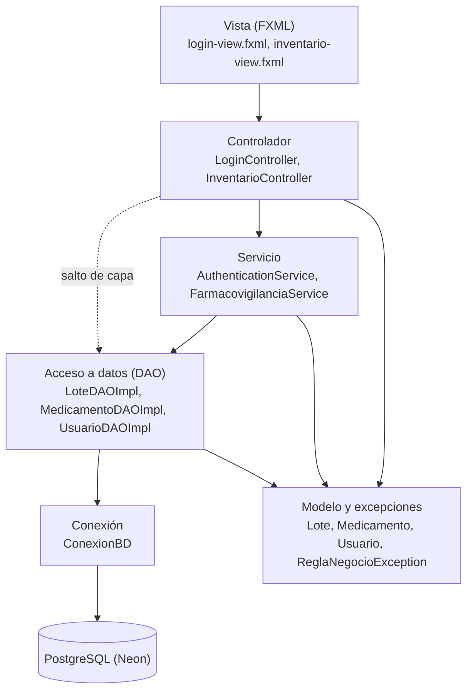
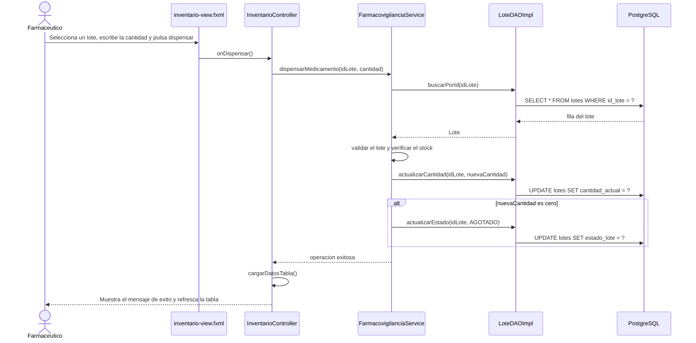

# HU-80 — Arquitectura por capas de CareStock

**Historia de Usuario:** HU-80  
**Código analizado:** `src/CareStock`, commit `0d85f9c` (merge del PR #624)  
**Fecha:** 10 de octubre de 2026

## 1. Objetivo y alcance

Este documento describe cómo está organizado en capas el código actual de CareStock (`src/CareStock`, paquete `org.example.carestock`), qué responsabilidad tiene cada capa y cómo viaja una petición desde la pantalla hasta la base de datos. Describe lo que el código hace hoy.

Los documentos `HU-88-capa-vista.md` y los de la serie HU-67 describen la aplicación anterior (`LoginFX`, `MainDashboardFX`, `UserSession`), que ya no existe en el repositorio. Para la arquitectura vigente, este documento prevalece.

Las clases se citan con su paquete relativo a `org.example.carestock`, por ejemplo `dao.LoteDAOImpl`. Las clases del paquete raíz se citan sin prefijo.

---

## 2. Visión general

La línea punteada indica que `InventarioController` accede a los DAO sin pasar por un servicio.

---

## 3. Capas, responsabilidades y clases reales

| Capa | Ubicación | Clases reales (ejemplos) | Qué hace | Qué no debe hacer |
|---|---|---|---|---|
| Vista (JavaFX) | `src/main/resources/org/example/carestock` | `login-view.fxml`, `inventario-view.fxml` | Define la disposición de cada pantalla y enlaza los controles con el controlador mediante `fx:id` y `onAction`. | Contener lógica de negocio, SQL ni reglas de validación. |
| Controlador | `controller` | `controller.LoginController`, `controller.InventarioController` | Recibe los eventos de la vista, lee y valida el formato de lo que escribe el usuario, llama a la lógica correspondiente y actualiza la pantalla (tabla, filtros, alertas). | Escribir SQL, abrir conexiones o decidir reglas de negocio. |
| Servicio | `service` | `service.AuthenticationService`, `service.FarmacovigilanciaService` | Aplica las reglas de negocio (credenciales, stock disponible, lote vencido) y coordina las llamadas a los DAO. | Conocer JavaFX ni escribir SQL. |
| Acceso a datos (DAO) | `dao` | `dao.LoteDAO`, `dao.LoteDAOImpl`, `dao.MedicamentoDAO`, `dao.MedicamentoDAOImpl`, `dao.UsuarioDAO`, `dao.UsuarioDAOImpl` | Traduce entre objetos del modelo y filas de PostgreSQL con JDBC y `PreparedStatement`. | Aplicar reglas de negocio ni depender de JavaFX. |
| Sesión y seguridad | `service` y paquete raíz | `service.AuthenticationService`, `CareStockApp` | Autenticación: verifica las credenciales del usuario. Navegación: `CareStockApp` arranca la aplicación y cambia entre las pantallas de login e inventario. | Dejar entrar a un usuario sin comprobar su contraseña ni su estado, ni exponer credenciales. |
| Base de datos PostgreSQL | Neon, scripts en `src/sql` | `config.ConexionBD` | Almacena usuarios, lotes, medicamentos y categorías. `ConexionBD` abre las conexiones JDBC. | Recibir consultas desde capas distintas del DAO. |
| Modelo y excepciones (transversal) | `model` y `exception` | `model.Lote`, `model.Medicamento`, `model.Usuario`, `model.Validable`, `exception.ReglaNegocioException` | Representa las entidades y valida sus propias reglas (`validar()`, `esAptoParaDispensar()`). `ReglaNegocioException` comunica una regla incumplida. | Depender de las capas superiores. |

---

## 4. Flujo general: dispensar un lote

Ejemplo de una petición que atraviesa todas las capas.

1. El farmacéutico selecciona un lote en la tabla de `inventario-view.fxml`, escribe la cantidad y pulsa el botón de dispensar.
2. La vista invoca `InventarioController.onDispensar()`, que comprueba que haya un lote seleccionado y que la cantidad sea un número entero.
3. El controlador llama a `FarmacovigilanciaService.dispensarMedicamento(idLote, cantidad)`.
4. El servicio pide el lote a `LoteDAOImpl.buscarPorId`, que ejecuta un `SELECT` en PostgreSQL a través de `ConexionBD`.
5. El servicio aplica las reglas de negocio: `Lote.validar()` rechaza lotes vencidos o bloqueados y luego se verifica que haya stock suficiente. Si una regla falla, lanza `ReglaNegocioException`.
6. Si todo es válido, el servicio llama a `LoteDAOImpl.actualizarCantidad` y, si el stock queda en cero, a `LoteDAOImpl.actualizarEstado` con el valor `AGOTADO`.
7. El controlador muestra el resultado (éxito o la regla incumplida) y recarga la tabla con `cargarDatosTabla()`.

