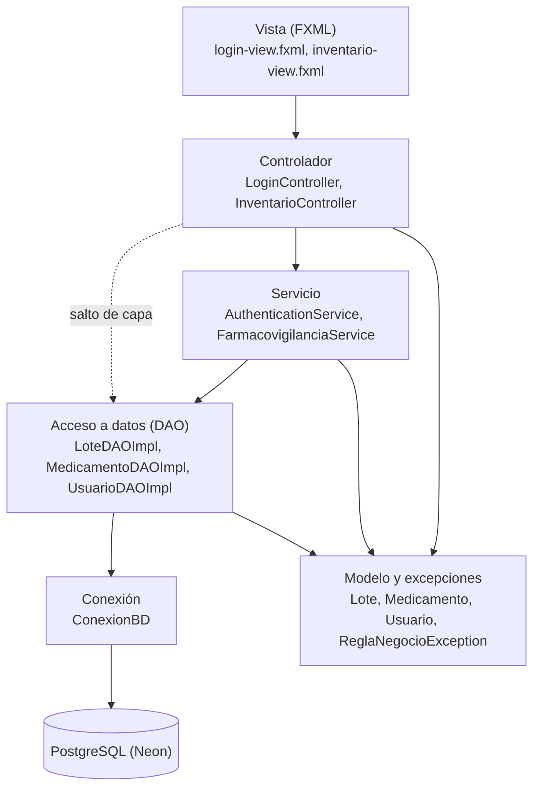
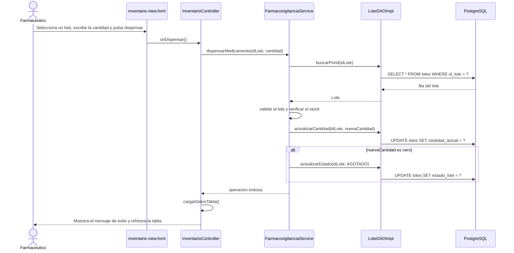

# HU-80 — Arquitectura por capas de CareStock

**Historia de Usuario:** HU-80  
**Código analizado:** `src/CareStock`, commit `0d85f9c` (merge del PR #624)  
**Fecha:** 10 de octubre de 2026

## 1. Objetivo y alcance

Este documento describe cómo está organizado en capas el código actual de CareStock (`src/CareStock`, paquete `org.example.carestock`), qué responsabilidad tiene cada capa y cómo viaja una petición desde la pantalla hasta la base de datos. Describe lo que el código hace hoy, incluidas las desviaciones respecto al diseño por capas esperado (sección 5).

Los documentos `HU-88-capa-vista.md` y los de la serie HU-67 describen la aplicación anterior (`LoginFX`, `MainDashboardFX`, `UserSession`), que ya no existe en el repositorio. Para la arquitectura vigente, este documento prevalece.

Las clases se citan con su paquete relativo a `org.example.carestock`, por ejemplo `dao.LoteDAOImpl`. Las clases del paquete raíz se citan sin prefijo.

---

## 2. Visión general

La línea punteada indica que `InventarioController` accede a los DAO sin pasar por un servicio (sección 5.1).

---

## 3. Capas, responsabilidades y clases reales

| Capa | Ubicación | Clases reales (ejemplos) | Qué hace | Qué no debe hacer |
|---|---|---|---|---|
| Vista (JavaFX) | `src/main/resources/org/example/carestock` | `login-view.fxml`, `inventario-view.fxml` | Define la disposición de cada pantalla y enlaza los controles con el controlador mediante `fx:id` y `onAction`. | Contener lógica de negocio, SQL ni reglas de validación. |
| Controlador | `controller` | `controller.LoginController`, `controller.InventarioController` | Recibe los eventos de la vista, lee y valida el formato de lo que escribe el usuario, llama a la lógica correspondiente y actualiza la pantalla (tabla, filtros, alertas). | Escribir SQL, abrir conexiones o decidir reglas de negocio. |
| Servicio | `service` | `service.AuthenticationService`, `service.FarmacovigilanciaService` | Aplica las reglas de negocio (credenciales, stock disponible, lote vencido) y coordina las llamadas a los DAO. | Conocer JavaFX ni escribir SQL. |
| Acceso a datos (DAO) | `dao` | `dao.LoteDAO`, `dao.LoteDAOImpl`, `dao.MedicamentoDAO`, `dao.MedicamentoDAOImpl`, `dao.UsuarioDAO`, `dao.UsuarioDAOImpl` | Traduce entre objetos del modelo y filas de PostgreSQL con JDBC y `PreparedStatement`. | Aplicar reglas de negocio ni depender de JavaFX. |
| Sesión y seguridad | `service` y paquete raíz | `service.AuthenticationService`, `CareStockApp` | Autenticación: verifica las credenciales del usuario. Navegación: `CareStockApp` arranca la aplicación y cambia entre las pantallas de login e inventario. | Dejar entrar a un usuario sin comprobar su contraseña ni su estado, ni exponer credenciales (estado actual en la sección 5.2). |
| Base de datos PostgreSQL | Neon, scripts en `src/sql` | `config.ConexionBD` | Almacena usuarios, lotes, medicamentos y categorías. `ConexionBD` abre las conexiones JDBC. | Recibir consultas desde capas distintas del DAO. |
| Modelo y excepciones (transversal) | `model` y `exception` | `model.Lote`, `model.Medicamento`, `model.Usuario`, `model.Validable`, `exception.ReglaNegocioException` | Representa las entidades y valida sus propias reglas (`validar()`, `esAptoParaDispensar()`). `ReglaNegocioException` comunica una regla incumplida. | Depender de las capas superiores. |

---

## 4. Flujo general: dispensar un lote

Ejemplo de una petición que atraviesa todas las capas.

1. El farmacéutico selecciona un lote en la tabla de `inventario-view.fxml`, escribe la cantidad y pulsa el botón de dispensar.
2. La vista invoca `InventarioController.onDispensar()`, que comprueba que haya un lote seleccionado y que la cantidad sea un número entero.
3. El controlador llama a `FarmacovigilanciaService.dispensarMedicamento(idLote, cantidad)`.
4. El servicio pide el lote a `LoteDAOImpl.buscarPorId`, que ejecuta un `SELECT` en PostgreSQL a través de `ConexionBD`.
5. El servicio aplica las reglas de negocio: `Lote.validar()` rechaza lotes vencidos o bloqueados y luego se verifica que haya stock suficiente. Si una regla falla, lanza `ReglaNegocioException`.
6. Si todo es válido, el servicio llama a `LoteDAOImpl.actualizarCantidad` y, si el stock queda en cero, a `LoteDAOImpl.actualizarEstado` con el valor `AGOTADO`.
7. El controlador muestra el resultado (éxito o la regla incumplida) y recarga la tabla con `cargarDatosTabla()`.

---

## 5. Observaciones sobre el cumplimiento de las capas

### 5.1 Desviaciones respecto al diseño por capas

- `controller.InventarioController` crea `dao.LoteDAOImpl` y `dao.MedicamentoDAOImpl` en su constructor y los usa directamente para listar lotes y categorías, sin un servicio intermedio. Solo la dispensación pasa por `service.FarmacovigilanciaService`.
- Controladores y servicios crean sus dependencias con `new` (por ejemplo `new LoteDAOImpl()`), por lo que quedan acoplados a la implementación y no se pueden reemplazar sin editar el código.
- `dao.UsuarioDAOImpl` escribe en consola con `System.out` y `System.err` el correo consultado, el estado del usuario y los errores.
- La dispensación no es una operación atómica. `service.FarmacovigilanciaService` lee el lote y luego llama por separado a `actualizarCantidad` y, si el stock llega a cero, a `actualizarEstado`. Cada método de `dao.LoteDAOImpl` abre su propia conexión y el código no usa `setAutoCommit`, `commit` ni `rollback`. Además, la aplicación no escribe en la tabla `log_movimientos`, así que la dispensación no queda registrada como movimiento.
- `model.Usuario` llena el campo `rol` con `id_rol` (un número), mientras su comentario menciona los roles REGENTE, FARMACEUTICO y ADMIN. La base de datos define SUPER_ADMIN, ADMINISTRADOR y FARMACEUTICO.
- Quedan restos de la plantilla de IntelliJ y de pruebas manuales sin función en la arquitectura: `HelloApplication`, `HelloController`, `hello-view.fxml`, `Launcher` y `PruebaConexion`. `Launcher` lanza `HelloApplication` en lugar de `CareStockApp`.
- El módulo `src/CareStock` no tiene pruebas automáticas.

### 5.2 Sesión y seguridad: estado actual

- **Autenticación.** `service.AuthenticationService` comprueba que el correo y la contraseña no estén vacíos, busca al usuario con `dao.UsuarioDAOImpl` y valida la contraseña. La condición de validación acepta el acceso cuando el valor almacenado comienza con el prefijo `$2a$` de bcrypt, por lo que la contraseña ingresada no se compara con el hash. El proyecto no incluye una librería de bcrypt.
- **Estado del usuario.** El estado (`ACTIVO`, `INACTIVO` o `BLOQUEADO`) se consulta, pero solo se imprime en consola; no se valida al iniciar sesión.
- **Sesión.** `controller.LoginController` recibe el `Usuario` autenticado y navega con `CareStockApp.getInstance().mostrarDashboard()`, pero no lo guarda en ningún lugar. No existe un objeto de sesión.
- **Autorización.** Ninguna clase usa el rol del usuario, por lo que no hay control de acceso por rol.
- **Credenciales de la base de datos.** `config.ConexionBD` tiene la URL, el usuario y la clave de PostgreSQL escritos en el código fuente.

Acciones recomendadas:

1. Verificar la contraseña contra el hash (en la base de datos con la función `crypt` de pgcrypto, o con una librería de bcrypt) y rechazar a los usuarios que no estén `ACTIVO`.
2. Mover las credenciales de la base de datos a variables de entorno y cambiar la clave actual.
3. Guardar el usuario autenticado en un contexto de sesión y usar su rol para restringir pantallas y acciones.
