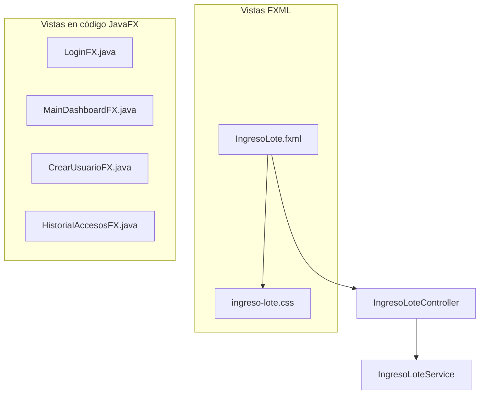

# HU-88 — Diseño de la Capa de Vista (Presentation Layer)

## Inventario de vistas

| Vista | Archivo | Hoja de estilo |
|---|---|---|
| Login | `LoginFX.java` | estilos inline (paleta oficial) |
| Dashboard principal | `MainDashboardFX.java` | estilos inline (paleta oficial) |
| Registro de ingreso de lote | `IngresoLote.fxml` | `ingreso-lote.css` |
| Crear usuario | `CrearUsuarioFX.java` | estilos inline |
| Historial de accesos | `HistorialAccesosFX.java` | estilos inline |

## Diagrama de la estructura de la capa de Vista

## Componente transversal: AlertUtil
`AlertUtil.java` centraliza los mensajes de éxito y error con la paleta oficial de CareStock, evitando que cada vista defina su propio estilo de alerta. Es usado por `MainDashboardFX` y por el flujo de ingreso de lote, cumpliendo el principio de **no repetición (DRY)** dentro de la capa de presentación.
