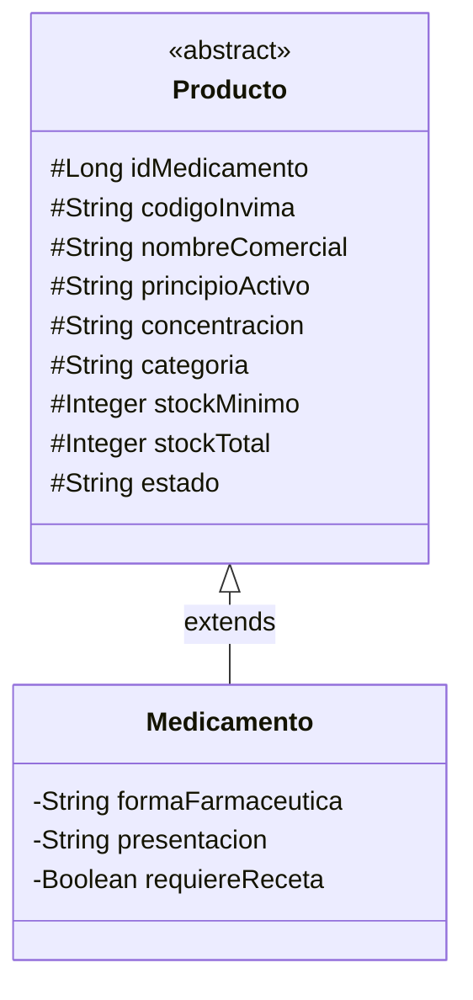

# Relación entre `Producto` y `Medicamento` — CareStock

## Tipo de relación: **Herencia**

`Medicamento extends Producto` — es decir, **`Medicamento` ES UN `Producto`**,
no lo contiene ni lo referencia como atributo. No es composición ni
asociación.

## Por qué importa esta distinción

- `Producto` es **abstracta** — no se puede instanciar directamente
  (`new Producto(...)` no compila). Solo existe para ser heredada.
- Actualmente `Medicamento` es la **única** subclase de `Producto` en el
  código. La jerarquía está preparada para que en el futuro existan otros
  tipos de producto (ej. insumos médicos no farmacéuticos) que también
  extiendan `Producto`, sin duplicar los atributos comunes (nombre,
  stock, categoría, etc.).
- Todos los atributos de `Producto` son `protected`, no `private` —
  intencional, para que las subclases (como `Medicamento`) puedan
  accederlos directamente sin pasar por getters/setters si es necesario.
