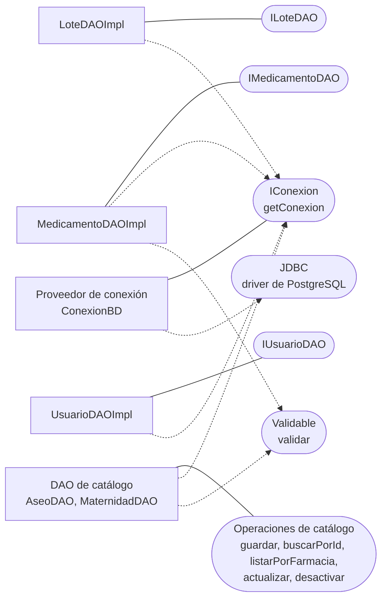

# Componente de acceso a datos (DAO) — CareStock

Parte 1 de 3 del diagrama de componentes de datos y del diagrama general (HU.87). Código fuente: `src/CareStock/src/main/java/org/example/carestock/` en `main`, commit `5239998`.

## 1. Diagrama

Leyenda: rectángulo = componente; óvalo = interfaz; línea continua = el componente **provee** la interfaz; flecha punteada = el componente **requiere** (usa) la interfaz.

## 2. Interfaces y operaciones

| Componente | Operaciones | Tablas |
|---|---|---|
| `LoteDAOImpl` (interfaz `LoteDAO`) | `guardar`, `buscarPorId`, `listarPorMedicamento`, `listarTodos`, `actualizarCantidad`, `actualizarEstado` | `lotes` |
| `MedicamentoDAOImpl` (interfaz `MedicamentoDAO`) | `guardar`, `buscarPorId`, `buscarPorCodigoInvima`, `listarTodos`, `actualizarEstado`, `listarCategorias`, `categoriaPorMedicamento` | `medicamentos`, `categorias` |
| `UsuarioDAOImpl` (interfaz `UsuarioDAO`) | `buscarPorEmail` | `usuarios` |
| `AseoDAO` (clase concreta) | `guardar(producto, idFarmacia, idUsuario)`, `buscarPorId(id, idFarmacia)`, `listarPorFarmacia(idFarmacia)`, `actualizar(...)`, `desactivar(...)` | `aseo` |
| `MaternidadDAO` (clase concreta) | Las mismas cinco operaciones | `maternidad` |
| `ConexionBD` | `getConexion()` devuelve una `java.sql.Connection` | Base de datos Neon |

## 3. Cómo trabaja el componente

- Cada operación abre una conexión con `ConexionBD.getConexion()` dentro de un `try-with-resources`, ejecuta una sentencia con parámetros y la cierra al terminar.
- `guardar` llama a `validar()` de la entidad antes del `INSERT` (en `MedicamentoDAOImpl`, `AseoDAO` y `MaternidadDAO`).
- Los DAO de catálogo **segregan por farmacia**: sus consultas y actualizaciones incluyen `id_farmacia = ?`, y las actualizaciones solo afectan registros `ACTIVO`.
- `UsuarioDAOImpl.buscarPorEmail` solo devuelve usuarios con `estado = 'ACTIVO'`.
- Patrón: **DAO con interfaz e implementación** para lotes, medicamentos y usuarios; los de catálogo no tienen interfaz.

## 4. Quién abre conexiones además de los DAO

`ConexionBD` no la usan solo los DAO. Estas clases ejecutan SQL directamente: `SesionUsuario`, `Inventario` (consulta de la farmacia del usuario), `RegistroLoteService` y `FarmacovigilanciaService`. Ninguna pasa por un DAO.

## 5. Observaciones verificadas en el código

| Hallazgo | Detalle |
|---|---|
| **Corregido:** estado de la cuenta | La consulta de usuarios ya filtra `ACTIVO` y el DAO dejó de escribir el correo en consola |
| Credenciales en el código | `ConexionBD` define URL, usuario y clave como constantes dentro del código fuente. Deben pasar a variables de entorno y la clave debe rotarse, porque quedó escrita en el historial de Git |
| Sin pool de conexiones | `DriverManager.getConnection` en cada operación |
| `LoteDAOImpl.listarTodos` no filtra por farmacia | Es el método que usa la pantalla de inventario |
| `LoteDAOImpl.guardar` no lo llama nadie | El registro de lotes lo hace `RegistroLoteService` con SQL propio |
| `AseoDAO` y `MaternidadDAO` sin interfaz | Los consume la fachada como clases concretas |
| `Usuario.rol` recibe `id_rol` | Se lee con `getString("id_rol")`: un número y no el nombre del rol |
| `PruebaConexion` | Clase con `main` para probar la lectura de lotes; no forma parte de la aplicación |
