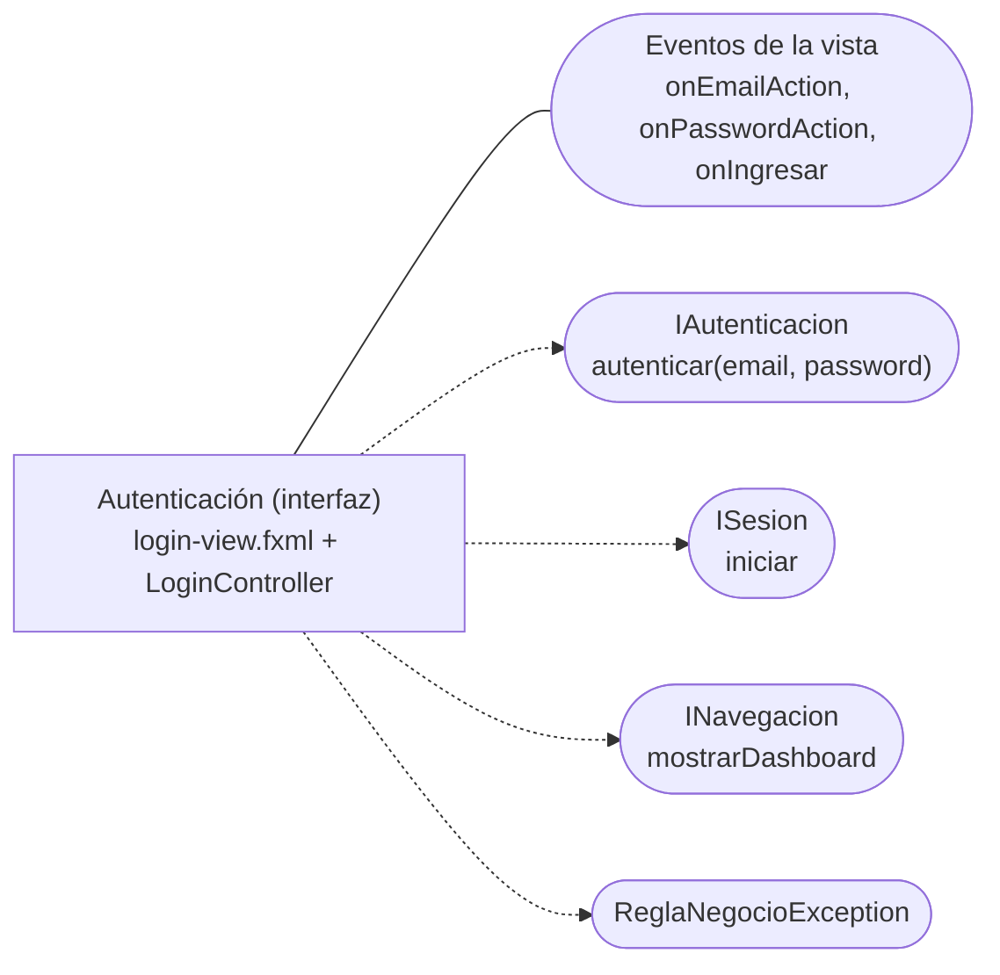

# Componente de autenticación de la interfaz (`LoginController`) — CareStock

Parte 2 de 3 del diagrama de componentes de presentación y sesión (HU.85). Código fuente: `src/CareStock/src/main/java/org/example/carestock/` en `main`, commit `5239998`.

## 1. Diagrama

Leyenda: rectángulo = componente; óvalo = interfaz; línea continua = el componente **provee** la interfaz; flecha punteada = el componente **requiere** (usa) la interfaz.

## 2. Especificación

| Elemento | Detalle |
|---|---|
| Responsabilidad | Capturar correo y contraseña, mostrar el estado de carga y los mensajes, abrir la sesión y pasar al inventario |
| Clases y recursos | `LoginController` y `login-view.fxml` (enlazados con `fx:controller`) |
| Interfaz que provee | `onEmailAction` (pasa el foco a la contraseña), `onPasswordAction` y `onIngresar` (ambos ejecutan el login) |
| Interfaces que requiere | `IAutenticacion.autenticar`, `ISesion.iniciar`, `INavegacion.mostrarDashboard`, `ReglaNegocioException` |
| Cómo obtiene sus dependencias | `new AuthenticationService()` en el constructor |
| Controles de la vista | `txtEmail`, `txtPassword`, `chkRecordarme`, `btnIngresar`, `loaderCarga`, `lblNotificacion` |

## 3. Secuencia de `ejecutarLogin`

1. Oculta el aviso y activa el estado de carga.
2. Llama a `autenticar(email, password)`.
3. Muestra "Acceso concedido".
4. Llama a `SesionUsuario.iniciar(usuario)`.
5. Llama a `CareStockApp.getInstance().mostrarDashboard()`.

| Resultado | Lo que hace el componente |
|---|---|
| Todo correcto | Pasa al inventario con la sesión abierta |
| `ReglaNegocioException` | Muestra el mensaje en rojo, limpia la contraseña y devuelve el foco al campo |
| Cualquier otra excepción | Muestra "Error al conectar con la base de datos" seguido del detalle, y escribe el error en consola |

## 4. Observaciones verificadas en el código

- El mensaje "Acceso concedido" aparece **antes** de abrir la sesión. Si `SesionUsuario.iniciar` falla (por ejemplo, el usuario dejó de estar activo), el usuario ve primero ese mensaje y luego el de "Error al conectar con la base de datos", que no describe la causa real.
- La casilla `chkRecordarme` existe en la vista y se bloquea durante la carga, pero ningún código la lee.
- No hay límite de intentos ni bloqueo de cuenta en este componente.
