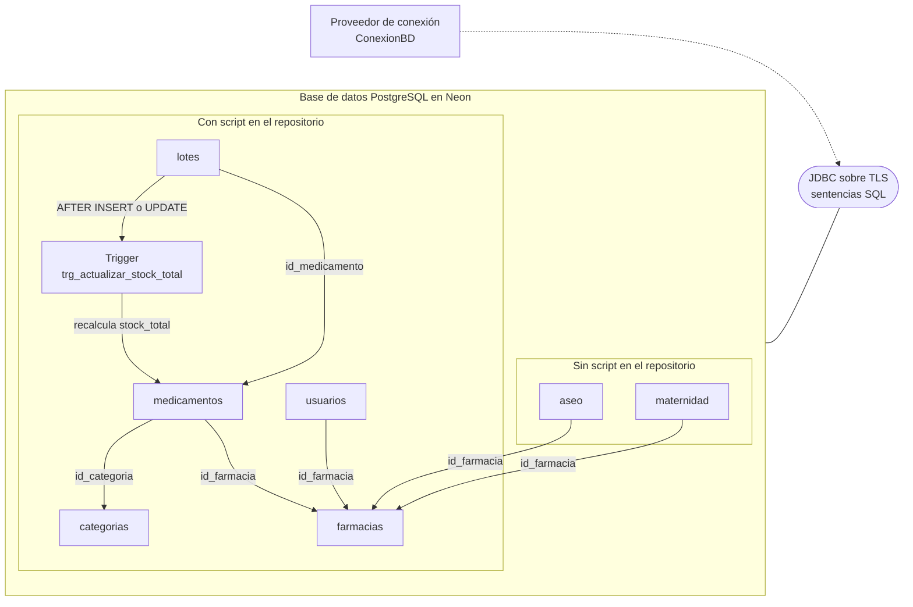

# Componente de base de datos (PostgreSQL en Neon) — CareStock

Parte 2 de 3 del diagrama de componentes de datos y del diagrama general (HU.87). Scripts en `src/sql/`; Código que la usa: `src/CareStock/src/main/java/org/example/carestock/` en `main`, commit `5239998`.

## 1. Diagrama



Leyenda: rectángulo = componente; óvalo = interfaz; línea continua = el componente **provee** la interfaz; flecha punteada = el componente **requiere** (usa) la interfaz.

## 2. Tablas que usa la aplicación

| Tabla | Quién la usa | Operaciones | Columnas relevantes |
|---|---|---|---|
| `lotes` | `LoteDAOImpl`, `RegistroLoteService`, `FarmacovigilanciaService` | `INSERT`, `SELECT`, `UPDATE` | `id_lote`, `numero_lote`, `id_medicamento`, `cantidad_actual`, `fecha_vencimiento`, `id_ubicacion`, `estado_lote`, `id_usuario`, `id_usuario_modificacion`, `fecha_modificacion` |
| `medicamentos` | `MedicamentoDAOImpl`, `RegistroLoteService`, `FarmacovigilanciaService` | `INSERT`, `SELECT`, `UPDATE` | `codigo_invima`, `nombre_comercial`, `id_categoria`, `stock_minimo`, `stock_total`, `estado`, `id_farmacia`, `id_usuario_creacion`, `id_usuario_modificacion`, `fecha_modificacion` |
| `categorias` | `MedicamentoDAOImpl` | `SELECT` | `id_categoria`, `nombre_categoria` |
| `usuarios` | `UsuarioDAOImpl`, `SesionUsuario`, `Inventario` | `SELECT` | `id_usuario`, `nombre_completo`, `email`, `password_hash`, `id_rol`, `estado`, `id_farmacia` |
| `farmacias` | `SesionUsuario`, `Inventario` | `SELECT` (con `LEFT JOIN` o `JOIN`) | `id_farmacia`, `nombre`, `estado` (`ACTIVA`) |
| `aseo` | `AseoDAO` | `INSERT`, `SELECT`, `UPDATE` | `codigo`, `nombre`, `descripcion`, `precio`, `stock`, `tipo_aseo`, `biodegradable`, `componentes_activos`, `id_farmacia`, `id_usuario_creacion`, `estado` |
| `maternidad` | `MaternidadDAO` | `INSERT`, `SELECT`, `UPDATE` | `codigo`, `nombre`, `descripcion`, `precio`, `stock`, `etapa_recomendada`, `hipoalergenico`, `edad_gestacional_sugerida`, `id_farmacia`, `id_usuario_creacion`, `estado` |

## 3. Dependencias con los scripts del repositorio

| La aplicación necesita | Lo crea el script |
|---|---|
| Las tablas `lotes`, `medicamentos`, `categorias`, `usuarios` | `ddl/01_schema_carestock.sql` |
| `farmacias` y la columna `medicamentos.id_farmacia` | `ddl/04_multifarmacia_inventario.sql` |
| `usuarios.id_farmacia` | `ddl/05_superadmin_jerarquia_usuarios_issue_456.sql` |
| Las columnas `id_usuario_modificacion` y `fecha_modificacion` de `medicamentos` y `lotes` | `ddl/06_crud_inventario_multifarmacia.sql` |
| El trigger `trg_actualizar_stock_total` | `ddl/02_functions_triggers.sql` |
| Las tablas `aseo` y `maternidad` | **Ningún script del repositorio** (`src/sql/` y `scripts/`) |

Las tablas `aseo` y `maternidad` tienen que existir en Neon para que funcione el catálogo, pero no hay un script que las cree. Quien clone el repositorio y ejecute los scripts no las tendrá.

## 4. El trigger y las actualizaciones manuales del stock

`trg_actualizar_stock_total` se ejecuta `AFTER INSERT OR UPDATE OF cantidad_actual, estado_lote ON LOTES` y recalcula `medicamentos.stock_total` como la suma de `cantidad_actual` de los lotes `DISPONIBLE`.

Dos servicios además modifican `stock_total` con un `UPDATE` propio:

| Servicio | `UPDATE` |
|---|---|
| `RegistroLoteService` | `stock_total = stock_total + cantidad` después de insertar el lote |
| `FarmacovigilanciaService` | `stock_total = stock_total - cantidad` después de actualizar el lote, con la condición `stock_total >= cantidad` |

Si el trigger está activo, el efecto sería: el trigger deja `stock_total` igual a la suma de los lotes disponibles y el servicio lo vuelve a ajustar. Al dispensar la totalidad de un lote, el trigger dejaría el total en cero y la condición `stock_total >= cantidad` del servicio no se cumpliría, de modo que la operación terminaría en "Stock total inconsistente".

**Verificación pendiente en Neon** (`SQL Editor`):

```sql
SELECT tgname, tgenabled
FROM pg_trigger
WHERE tgrelid = 'lotes'::regclass AND NOT tgisinternal;
```

Si devuelve `trg_actualizar_stock_total` con `tgenabled = 'O'`, el trigger está activo y hay que quitar uno de los dos mecanismos. Si no devuelve filas, los servicios son los únicos que mantienen el stock.

## 5. Objetos que existen y la aplicación no usa

| Objeto | Tipo | Estado |
|---|---|---|
| `ROLES`, `UBICACIONES`, `PREFERENCIAS_USUARIO`, `LOG_ACCESOS` | Tablas | Sin DAO |
| `LOG_MOVIMIENTOS`, `movimientos_stock` | Tablas de trazabilidad | Ni la dispensación ni el registro de lote escriben movimientos |
| `sp_registrar_nuevo_lote`, `fn_despachar_lote`, `fn_crear_*_seguro`, `fn_validar_gestion_farmacia` | Procedimiento y funciones | Los servicios usan `INSERT` y `UPDATE` propios |
| `vw_alertas_vencimiento`, `vw_resumen_farmacias`, `VW_MOVIMIENTOS_FARMACIA` y otras vistas | Vistas | Siguen en `src/sql/`, sin clase Java que las consulte |

El modelo relacional completo del esquema está en `MODELO_RELACIONAL_MULTIFARMACIA.md`.
