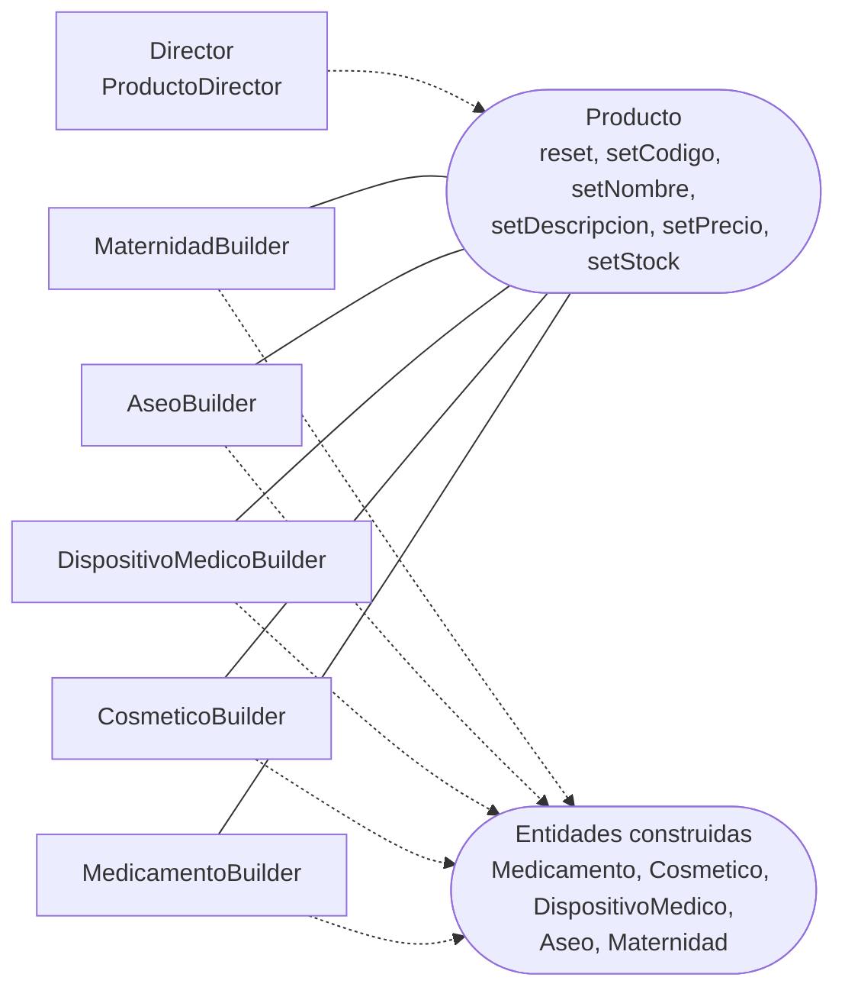

# Componente de creación de productos (Builder y Director) — CareStock

Parte 3 de 3 del diagrama de componentes de negocio y dominio (HU.86). Código fuente: `src/CareStock/src/main/java/org/example/carestock/` en `main`, commit `5239998`.

## 1. Diagrama

Leyenda: rectángulo = componente; óvalo = interfaz; línea continua = el componente **provee** la interfaz; flecha punteada = el componente **requiere** (usa) la interfaz.

## 2. Especificación

| Componente | Responsabilidad | Relación |
|---|---|---|
| `Producto` | Interfaz del constructor: `reset()` y setters encadenables (`setCodigo`, `setNombre`, `setDescripcion`, `setPrecio`, `setStock`) | La implementan los cinco constructores |
| `MedicamentoBuilder`, `CosmeticoBuilder`, `DispositivoMedicoBuilder` | Construir cada tipo de producto | Implementan `Producto` |
| `AseoBuilder` | Construir un `Aseo`; agrega `tipoAseo`, `biodegradable` y `componentesActivos` | Implementa `Producto` |
| `MaternidadBuilder` | Construir un `Maternidad` | Implementa `Producto` |
| `ProductoDirector` | Armar un producto de ejemplo con un constructor. Tipos: `estandar`, `premium`, `aseo_ecologico` (exige un `AseoBuilder`) y `maternidad_cuidados` (exige un `MaternidadBuilder`) | Recibe un `Producto`, rechaza uno nulo y permite cambiarlo con `changeBuilder` |

El patrón es **Builder con Director**: el director conoce la receta y cada constructor sabe crear su entidad.

## 3. Estado de integración

| Pieza | Quién la usa |
|---|---|
| `AseoBuilder` y `MaternidadBuilder` | `CatalogoController` (para armar el producto de la pantalla) y `AseoDAO` y `MaternidadDAO` |
| `ProductoDirector` | Ninguna clase de la aplicación |
| `MedicamentoBuilder`, `CosmeticoBuilder`, `DispositivoMedicoBuilder` | Ninguna clase de la aplicación fuera de las propias entidades |
| `Medicamento.builder()` y `DispositivoMedico.builder()` | Nadie los invoca |

## 4. Observaciones verificadas en el código

| Hallazgo | Evidencia |
|---|---|
| El Builder **sí está integrado** para los dos productos del catálogo: la pantalla construye con `AseoBuilder` y `MaternidadBuilder` | `CatalogoController` |
| El Director sigue sin invocarse; sus valores son datos de ejemplo fijos | `ProductoDirector.make` |
| Existen **dos** clases llamadas `MedicamentoBuilder`: una anidada en `Medicamento` y otra independiente que implementa `Producto` | `Medicamento.java` y `MedicamentoBuilder.java` |
| `MedicamentoBuilder.setDescripcion` devuelve `null`, lo que rompería un encadenamiento posterior | `MedicamentoBuilder.java` |
| `Producto` pide `setPrecio`, pero `Medicamento` no tiene precio: el valor se descarta | `MedicamentoBuilder.setPrecio` |
