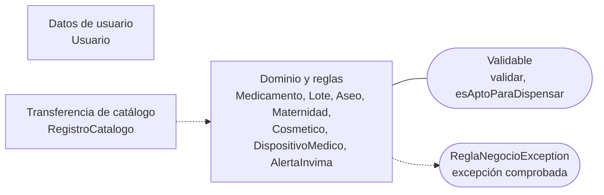

# Componente de dominio y reglas de negocio — CareStock

Parte 2 de 3 del diagrama de componentes de negocio y dominio (HU.86). Código fuente: `src/CareStock/src/main/java/org/example/carestock/` en `main`, commit `5239998`.

## 1. Diagrama

Leyenda: rectángulo = componente; óvalo = interfaz; línea continua = el componente **provee** la interfaz; flecha punteada = el componente **requiere** (usa) la interfaz.

## 2. Entidades y su contrato

`Validable` define dos operaciones: `validar()`, que lanza `ReglaNegocioException` si el objeto no cumple las reglas, y `esAptoParaDispensar()`, que indica si se puede entregar.

| Entidad | Implementa `Validable` | Reglas verificadas en `validar()` |
|---|---|---|
| `Medicamento` | Sí | Nombre comercial y código INVIMA obligatorios; stock mínimo y total no negativos; rechaza el estado `BLOQUEADO` |
| `Lote` | Sí | Número de lote, medicamento y fecha de vencimiento obligatorios; cantidad no negativa; rechaza un lote vencido y un lote en un estado que impide su uso |
| `Aseo` | Sí | Código, nombre y descripción obligatorios; precio válido y no negativo; estado `ACTIVO` o `INACTIVO`; stock no negativo |
| `Maternidad` | Sí | Código, nombre y descripción obligatorios; precio válido y no negativo; stock no negativo |
| `Cosmetico` | Sí | Nombre y registro sanitario obligatorios; precio y stock no negativos |
| `DispositivoMedico` | Sí | Nombre y clase de riesgo obligatorios; precio válido y no negativo; stock no negativo |
| `AlertaInvima` | Sí | Debe asociarse a un código de medicamento y tener motivo |
| `Usuario` | No | Contenedor de datos: id, nombre, correo, contraseña y rol |

`RegistroCatalogo<T>` es un registro (`record`) con tres campos: `id`, `producto` y `estado`. Los DAO de catálogo lo usan para devolver cada producto junto con su identificador y su estado, y vive en el paquete `DataTransferObject`.

## 3. Excepción del dominio

`ReglaNegocioException` extiende `Exception`: es una excepción **comprobada**, así que los métodos que la lanzan o la propagan declaran `throws`. Los DAO y los servicios declaran `throws Exception`, lo que amplía esa firma.

## 4. Quién usa este componente

| Usuario del componente | Cómo lo usa |
|---|---|
| `AseoDAO` y `MaternidadDAO` | Llaman a `validar()` al guardar |
| `MedicamentoDAOImpl.guardar` y `Inventario.registrarMedicamento` | Llaman a `validar()` antes del `INSERT` |
| `RegistroLoteService` | Llama a `lote.validar()` antes de registrar el lote |
| `InventarioController` | Usa `Lote::esAptoParaDispensar` como filtro de la tabla |
| `AuthenticationService`, `LoginController` | Lanzan y capturan `ReglaNegocioException` |

## 5. Observaciones verificadas en el código

- `AlertaInvima` está implementada pero ninguna clase la usa: no hay DAO, servicio ni pantalla.
- `Cosmetico` y `DispositivoMedico` solo los usan sus propios constructores.
- `Usuario.rol` se llena con `id_rol` (un número), no con el nombre del rol.
- Las entidades de aseo y maternidad no tienen interfaz propia: los DAO de catálogo son clases concretas.
