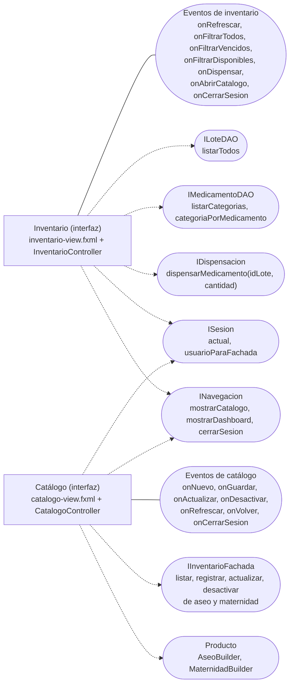

# Componentes de inventario y catálogo de la interfaz — CareStock

Parte 3 de 3 del diagrama de componentes de presentación y sesión (HU.85). Código fuente: `src/CareStock/src/main/java/org/example/carestock/` en `main`, commit `5239998`.

## 1. Diagrama

Leyenda: rectángulo = componente; óvalo = interfaz; línea continua = el componente **provee** la interfaz; flecha punteada = el componente **requiere** (usa) la interfaz.

## 2. Componente de inventario

| Elemento | Detalle |
|---|---|
| Responsabilidad | Mostrar los lotes en una tabla, filtrarlos, dispensar unidades de un lote y navegar al catálogo |
| Clases y recursos | `InventarioController` e `inventario-view.fxml` |
| Interfaz que provee | Siete manejadores: refrescar, tres filtros, dispensar, abrir catálogo y cerrar sesión |
| Interfaces que requiere | `ILoteDAO.listarTodos`; `IMedicamentoDAO.listarCategorias` y `categoriaPorMedicamento`; `IDispensacion.dispensarMedicamento`; `ISesion.actual`; `INavegacion` |
| Cómo obtiene sus dependencias | `new LoteDAOImpl()`, `new MedicamentoDAOImpl()` y `new FarmacovigilanciaService()` en el constructor |

La tabla combina tres predicados (`filtroTexto`, `filtroEstado`, `filtroCategoria`) con `Predicate.and`, sobre una `FilteredList` y una `SortedList`. Al abrirse, `cargarInformacionSesion` lanza `IllegalStateException` si no hay sesión activa; con sesión, muestra en etiquetas el nombre, el correo, el rol (`Rol #N`) y la farmacia con su id.

## 3. Componente de catálogo

| Elemento | Detalle |
|---|---|
| Responsabilidad | Gestionar los productos de aseo y de maternidad de la farmacia del usuario |
| Clases y recursos | `CatalogoController` y `catalogo-view.fxml` |
| Interfaz que provee | Siete manejadores: nuevo, guardar, actualizar, desactivar, refrescar, volver y cerrar sesión |
| Interfaces que requiere | `IInventarioFachada`; los constructores `AseoBuilder` y `MaternidadBuilder` (contrato `Producto`); `ISesion.usuarioParaFachada`; `INavegacion` |
| Cómo obtiene sus dependencias | `new Inventario(SesionUsuario.usuarioParaFachada())` |

Operaciones de la fachada que usa: `listarAseo`, `listarMaternidad`, `registrarAseo`, `registrarMaternidad`, `actualizarAseo`, `actualizarMaternidad`, `desactivarAseo` y `desactivarMaternidad`.

## 4. Observaciones verificadas en el código

- `InventarioController` sigue llamando a `LoteDAOImpl` y `MedicamentoDAOImpl` **directamente** para las lecturas, sin servicio. `CatalogoController`, en cambio, pasa por la fachada.
- `InventarioController` llama a la versión **de dos argumentos** de `dispensarMedicamento`, que está marcada `@Deprecated` y no comprueba la farmacia del lote ni registra al usuario. La versión de cuatro argumentos, que sí lo hace, solo la usa la fachada, y la fachada no tiene ningún llamador en las pantallas.
- `LoteDAOImpl.listarTodos` no filtra por farmacia, así que la tabla de inventario muestra los lotes de todas las farmacias aunque la etiqueta indique la del usuario.
- La tabla muestra `id_medicamento` (un número), no el nombre del medicamento.
- La fachada tiene métodos sin llamador en las pantallas: `buscarAseo`, `buscarMaternidad`, `registrarMedicamento`, `registrarLote` y `dispensarMedicamento`.
