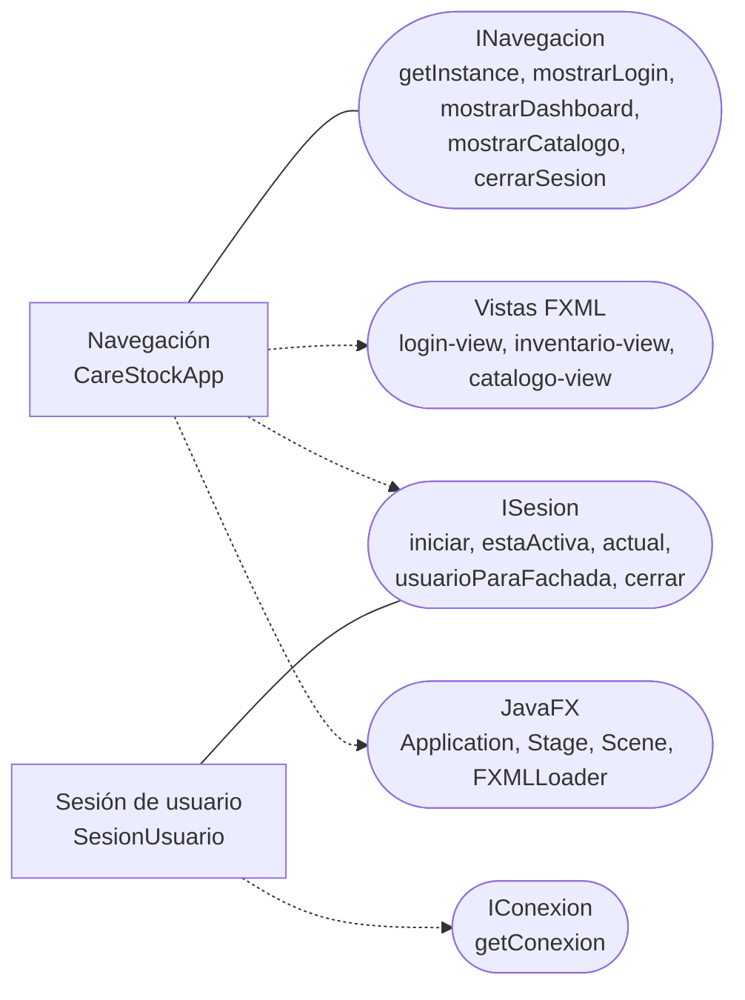

# Componente de navegación y sesión — CareStock

Parte 1 de 3 del diagrama de componentes de presentación y sesión (HU.85). Código fuente: `src/CareStock/src/main/java/org/example/carestock/` en `main`, commit `5239998`.

## 1. Diagrama

Leyenda: rectángulo = componente; óvalo = interfaz; línea continua = el componente **provee** la interfaz; flecha punteada = el componente **requiere** (usa) la interfaz.

## 2. Especificación

| Componente | Responsabilidad | Provee | Requiere |
|---|---|---|---|
| `CareStockApp` | Arrancar la aplicación JavaFX, guardar el `Stage` principal y cambiar de pantalla con una transición de desvanecimiento | `INavegacion`: `getInstance`, `mostrarLogin`, `mostrarDashboard`, `mostrarCatalogo`, `cerrarSesion` | `ISesion` (`estaActiva` y `cerrar`), las vistas FXML y las clases de JavaFX |
| `SesionUsuario` | Guardar los datos del usuario autenticado y de su farmacia mientras la aplicación está abierta | `ISesion`: `iniciar(Usuario)`, `estaActiva()`, `actual()`, `usuarioParaFachada()`, `cerrar()` | `IConexion`: consulta `usuarios` unido con `farmacias` |

## 3. Cómo se protege cada pantalla

| Operación de `CareStockApp` | Comportamiento |
|---|---|
| `mostrarLogin()` | Cierra la sesión (`SesionUsuario.cerrar()`) y carga `login-view.fxml` |
| `mostrarDashboard()` | Si no hay sesión activa vuelve al login; si la hay, carga `inventario-view.fxml` |
| `mostrarCatalogo()` | Igual que el dashboard, con `catalogo-view.fxml` |
| `cerrarSesion()` | Cierra la sesión y vuelve al login |

Las tres escenas son de 1100 x 650. Si no se encuentra el archivo FXML, se escribe un mensaje por la salida de error y no se cambia de pantalla.

## 4. Datos que guarda la sesión

`SesionUsuario.actual()` devuelve un registro `DatosUsuario` con: `id`, `nombre`, `email`, `rol`, `idFarmacia` y `farmacia` (el nombre).

`iniciar(usuario)` consulta la base de datos con `u.id_usuario = ?` y `UPPER(u.estado) = 'ACTIVO'`, de modo que una cuenta que dejó de estar activa no abre sesión: lanza `IllegalStateException`. Si el usuario es nulo o su id no es positivo, lanza `IllegalArgumentException`.

## 5. Observaciones verificadas en el código

- El estado de la sesión es **estático** (`private static volatile DatosUsuario actual`) y la clase tiene constructor privado. Es un Singleton por campo estático, no por instancia.
- El campo `rol` se llena con el texto `"Rol #"` seguido del `id_rol` (por ejemplo `Rol #2`). No contiene el nombre del rol, así que ninguna pantalla puede distinguir roles todavía.
- `SesionUsuario` ejecuta SQL directamente con `ConexionBD`, sin pasar por un DAO.
- `usuarioParaFachada()` devuelve un `Usuario` con solo el `id`; la fachada de inventario vuelve a consultar la farmacia del usuario cada vez que la necesita.
- `Launcher`, `HelloApplication`, `HelloController` y `hello-view.fxml` son la plantilla del asistente de JavaFX y no forman parte del flujo.
