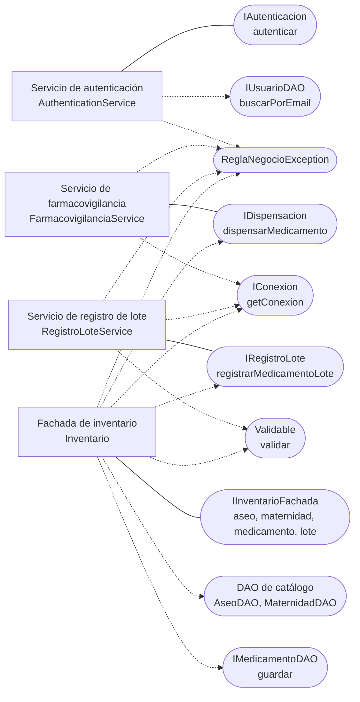

# Componente de servicios y fachada de negocio — CareStock

Parte 1 de 3 del diagrama de componentes de negocio y dominio (HU.86). Código fuente: `src/CareStock/src/main/java/org/example/carestock/` en `main`, commit `5239998`.

## 1. Diagrama

Leyenda: rectángulo = componente; óvalo = interfaz; línea continua = el componente **provee** la interfaz; flecha punteada = el componente **requiere** (usa) la interfaz.

## 2. Especificación

| Componente | Responsabilidad | Provee | Requiere |
|---|---|---|---|
| `AuthenticationService` | Verificar correo y contraseña | `IAutenticacion.autenticar` | `IUsuarioDAO`, la librería BCrypt, `ReglaNegocioException` |
| `FarmacovigilanciaService` | Dispensar unidades de un lote respetando las reglas sanitarias | `IDispensacion`: `dispensarMedicamento(idLote, cantidad)` (deprecada) y `dispensarMedicamento(idLote, cantidad, idFarmacia, idUsuario)` | `IConexion` (SQL directo), `ReglaNegocioException` |
| `RegistroLoteService` | Registrar un lote y subir el stock del medicamento en una sola transacción | `IRegistroLote.registrarMedicamentoLote(lote, idUsuario, idFarmacia)` | `IConexion` (SQL directo), `Validable` (`lote.validar`), `ReglaNegocioException` |
| `Inventario` (fachada) | Dar un único punto de entrada para las operaciones de inventario de la farmacia del usuario | `IInventarioFachada` | `AseoDAO`, `MaternidadDAO`, `IMedicamentoDAO`, `IRegistroLote`, `IDispensacion`, `IConexion`, `Validable`, `ReglaNegocioException` |

## 3. Reglas que aplica cada servicio

**`AuthenticationService.autenticar`** lanza `ReglaNegocioException` cuando:

| Condición | Mensaje |
|---|---|
| Correo o contraseña vacíos | Debe ingresar correo y contrasena |
| No hay un usuario activo con ese correo | Credenciales incorrectas o usuario inactivo |
| El hash guardado no tiene formato BCrypt | Credenciales incorrectas o usuario inactivo |
| `BCrypt.checkpw` no coincide | Credenciales incorrectas o usuario inactivo |

Antes de devolver al usuario, el servicio borra su contraseña (`setPassword(null)`).

**`FarmacovigilanciaService.dispensarMedicamento`** (versión de cuatro argumentos), dentro de una transacción:

1. Exige `idFarmacia > 0`, `idUsuario > 0` y `cantidad > 0`.
2. Lee el lote unido a su medicamento con bloqueo (`FOR UPDATE OF l, m`).
3. Rechaza si el lote no existe, si pertenece a otra farmacia, si no está `DISPONIBLE`, si está vencido o si la cantidad supera la existencia.
4. Actualiza `lotes` (cantidad, estado `AGOTADO` si llega a cero, fecha y usuario de modificación).
5. Resta la cantidad de `medicamentos.stock_total`; si no hay stock suficiente en el total, lanza "Stock total inconsistente".
6. `commit`; ante cualquier error, `rollback`; siempre restaura el `autoCommit`.

La versión de dos argumentos hace lo mismo pero sin comprobar la farmacia y sin registrar al usuario.

**`RegistroLoteService.registrarMedicamentoLote`**: exige cantidad positiva y ubicación; asigna el usuario y el estado `DISPONIBLE` por defecto; llama a `lote.validar()`; y en una transacción comprueba que el medicamento exista, esté `ACTIVO` y sea de la farmacia (con bloqueo), inserta el lote y suma la cantidad a `stock_total`.

**`Inventario` (fachada)** resuelve la farmacia del usuario con una consulta (`usuarios` unido con `farmacias`, ambos activos) cada vez que se llama; si no la encuentra lanza "Usuario inactivo o sin farmacia activa asignada". `registrarMedicamento` fija la farmacia, el usuario creador, el stock en cero y el estado `ACTIVO` por defecto, exige categoría y principio activo, y llama a `validar()`.

## 4. Observaciones verificadas en el código

- **Cambio frente a la versión anterior:** la autenticación ahora usa `BCrypt.checkpw`, y la dispensación y el registro de lote son transaccionales.
- **Posible doble conteo del stock (a verificar):** `FarmacovigilanciaService` y `RegistroLoteService` modifican `medicamentos.stock_total` con un `UPDATE` propio, pero el repositorio define el trigger `trg_actualizar_stock_total`, que recalcula ese mismo campo cada vez que cambia `lotes`. Si el trigger está activo en Neon, el stock se ajustaría dos veces. Cómo comprobarlo está en `COMPONENTE_BASE_DATOS.md`.
- **SQL fuera de los DAO:** `FarmacovigilanciaService`, `RegistroLoteService` y `Inventario` abren conexiones y escriben SQL directamente.
- **Sin llamador en las pantallas:** `Inventario.registrarMedicamento`, `registrarLote` y `dispensarMedicamento`, y por tanto `RegistroLoteService`, no los invoca ningún controlador.
- **Dependencias creadas con `new`:** `Inventario`, `AuthenticationService` y los controladores instancian sus colaboradores directamente.
