# Diagrama de componentes general — CareStock

Integra las tres partes documentadas en las HU.85, HU.86 y HU.87. Código fuente: `src/CareStock/src/main/java/org/example/carestock/` en `main`, commit `5239998`.

## 1. Diagrama general

```mermaid
flowchart TB
    subgraph PRES["Presentación (JavaFX)"]
        NAV["Navegación<br/>CareStockApp"]
        AUI["Autenticación (interfaz)<br/>LoginController + login-view"]
        IUI["Inventario (interfaz)<br/>InventarioController + inventario-view"]
        CUI["Catálogo (interfaz)<br/>CatalogoController + catalogo-view"]
    end

    subgraph SEG["Sesión y seguridad"]
        SES["Sesión de usuario<br/>SesionUsuario"]
        SAUT["Servicio de autenticación<br/>AuthenticationService"]
    end

    subgraph NEG["Servicios y fachada"]
        FAC["Fachada de inventario<br/>Inventario"]
        SDIS["Servicio de farmacovigilancia<br/>FarmacovigilanciaService"]
        SREG["Servicio de registro de lote<br/>RegistroLoteService"]
    end

    subgraph DOMN["Dominio"]
        DOM["Dominio y reglas<br/>entidades + Validable + ReglaNegocioException"]
        CRE["Creación de productos<br/>Producto, Builders, Director"]
    end

    subgraph DAT["Acceso a datos"]
        DLOTE["LoteDAOImpl"]
        DMED["MedicamentoDAOImpl"]
        DUSU["UsuarioDAOImpl"]
        DCAT["DAO de catálogo<br/>AseoDAO, MaternidadDAO"]
        CON["Proveedor de conexión<br/>ConexionBD"]
    end

    PG[("PostgreSQL en Neon")]

    INAV(["INavegacion"])
    ISES(["ISesion"])
    IAUT(["IAutenticacion"])
    IFAC(["IInventarioFachada"])
    IDISP(["IDispensacion"])
    IREGL(["IRegistroLote"])
    ILOTE(["ILoteDAO"])
    IMED(["IMedicamentoDAO"])
    IUSU(["IUsuarioDAO"])
    IVAL(["Validable"])
    IPROD(["Producto"])
    ICAT(["Operaciones de catálogo"])
    IREG(["ReglaNegocioException"])
    ICON(["IConexion"])

    NAV --- INAV
    SES --- ISES
    SAUT --- IAUT
    FAC --- IFAC
    SDIS --- IDISP
    SREG --- IREGL
    DLOTE --- ILOTE
    DMED --- IMED
    DUSU --- IUSU
    DOM --- IVAL
    CRE --- IPROD
    DCAT --- ICAT
    DOM --- IREG
    CON --- ICON

    NAV -.-> ISES
    AUI -.-> IAUT
    AUI -.-> ISES
    AUI -.-> INAV
    IUI -.-> ILOTE
    IUI -.-> IMED
    IUI -.-> IDISP
    IUI -.-> ISES
    IUI -.-> INAV
    CUI -.-> IFAC
    CUI -.-> IPROD
    CUI -.-> ISES
    CUI -.-> INAV

    SAUT -.-> IUSU
    SAUT -.-> IREG
    SDIS -.-> IREG
    SREG -.-> IREG
    FAC -.-> IREG
    AUI -.-> IREG
    FAC -.-> IMED
    FAC -.-> IREGL
    FAC -.-> IDISP
    FAC -.-> ICAT
    SES -.-> ICON
    FAC -.-> ICON
    SDIS -.-> ICON
    SREG -.-> ICON
    SREG -.-> IVAL
    DMED -.-> IVAL
    DCAT -.-> IVAL
    DLOTE -.-> ICON
    DMED -.-> ICON
    DUSU -.-> ICON
    DCAT -.-> ICON
    CRE -.-> DOM
    CON -->|"JDBC sobre TLS"| PG
```

Leyenda: rectángulo = componente; óvalo = interfaz; línea continua = el componente **provee** la interfaz; flecha punteada = el componente **requiere** (usa) la interfaz.

## 2. Catálogo de interfaces

| Interfaz | Operaciones | La provee | La requieren |
|---|---|---|---|
| `INavegacion` | `getInstance`, `mostrarLogin`, `mostrarDashboard`, `mostrarCatalogo`, `cerrarSesion` | `CareStockApp` | `LoginController`, `InventarioController`, `CatalogoController` |
| `ISesion` | `iniciar`, `estaActiva`, `actual`, `usuarioParaFachada`, `cerrar` | `SesionUsuario` | `CareStockApp`, los tres controladores |
| `IAutenticacion` | `autenticar(email, password)` | `AuthenticationService` | `LoginController` |
| `IInventarioFachada` | Operaciones de aseo, maternidad, medicamento, lote y dispensación | `Inventario` | `CatalogoController` |
| `IDispensacion` | `dispensarMedicamento` (dos sobrecargas) | `FarmacovigilanciaService` | `InventarioController`, `Inventario` |
| `IRegistroLote` | `registrarMedicamentoLote(lote, idUsuario, idFarmacia)` | `RegistroLoteService` | `Inventario` |
| `ILoteDAO` | `guardar`, `buscarPorId`, `listarPorMedicamento`, `listarTodos`, `actualizarCantidad`, `actualizarEstado` | `LoteDAOImpl` | `InventarioController` |
| `IMedicamentoDAO` | `guardar`, `buscarPorId`, `buscarPorCodigoInvima`, `listarTodos`, `actualizarEstado`, `listarCategorias`, `categoriaPorMedicamento` | `MedicamentoDAOImpl` | `InventarioController`, `Inventario` |
| `IUsuarioDAO` | `buscarPorEmail` | `UsuarioDAOImpl` | `AuthenticationService` |
| `Validable` | `validar`, `esAptoParaDispensar` | Las entidades del dominio | `MedicamentoDAOImpl`, `AseoDAO`, `MaternidadDAO`, `RegistroLoteService`, `Inventario`, `InventarioController` |
| `Producto` | `reset`, `setCodigo`, `setNombre`, `setDescripcion`, `setPrecio`, `setStock` | Los cinco constructores | `CatalogoController`, `ProductoDirector` |
| `Operaciones de catálogo` | `guardar`, `buscarPorId`, `listarPorFarmacia`, `actualizar`, `desactivar` | `AseoDAO`, `MaternidadDAO` | `Inventario` |
| `ReglaNegocioException` | Excepción comprobada que se lanza cuando se incumple una regla | Dominio y reglas | `LoginController`, `AuthenticationService`, `FarmacovigilanciaService`, `RegistroLoteService`, `Inventario` |
| `IConexion` | `getConexion` | `ConexionBD` | Los cinco DAO, `SesionUsuario`, `Inventario`, `RegistroLoteService`, `FarmacovigilanciaService` |

## 3. Dependencias que se saltan una capa

| Desde | Hacia | Qué se salta |
|---|---|---|
| `InventarioController` | `LoteDAOImpl`, `MedicamentoDAOImpl` | El servicio: la pantalla lee directamente del DAO |
| `SesionUsuario`, `Inventario`, `RegistroLoteService`, `FarmacovigilanciaService` | `ConexionBD` | El DAO: estas clases escriben SQL propio |

## 4. Componentes que existen y no están conectados

| Componente | Estado |
|---|---|
| `ProductoDirector`; `MedicamentoBuilder`, `CosmeticoBuilder`, `DispositivoMedicoBuilder` | Sin invocaciones desde la aplicación |
| `AlertaInvima`, `Cosmetico`, `DispositivoMedico` | Sin DAO, servicio ni pantalla |
| `Inventario.registrarMedicamento`, `registrarLote`, `dispensarMedicamento`, `buscarAseo`, `buscarMaternidad` y `RegistroLoteService` | Sin llamador en las pantallas |
| `Launcher`, `HelloApplication`, `HelloController`, `PruebaConexion` | Plantilla de ejemplo y prueba manual |

## 5. Hallazgos

**Corregidos desde la versión anterior** (por el equipo): la contraseña ahora se verifica con `BCrypt.checkpw`; las cuentas no activas no pueden autenticarse; existe una sesión (`SesionUsuario`); la dispensación y el registro de lote son transaccionales; el catálogo de aseo y maternidad segrega por farmacia.

**Abiertos:**

| # | Hallazgo | Dónde se detalla |
|---|---|---|
| 1 | `ConexionBD` guarda la URL, el usuario y la clave como constantes dentro del código fuente | `COMPONENTE_ACCESO_DATOS.md` |
| 2 | Posible doble conteo del stock: dos servicios actualizan `stock_total` y el trigger también (verificar en Neon) | `COMPONENTE_BASE_DATOS.md` |
| 3 | La pantalla de inventario lista los lotes de todas las farmacias y usa la dispensación deprecada, que no comprueba la farmacia | `COMPONENTE_INVENTARIO_CATALOGO_UI.md` |
| 4 | Las tablas `aseo` y `maternidad` no tienen script en el repositorio | `COMPONENTE_BASE_DATOS.md` |
| 5 | El rol de la sesión es `Rol #N`, sin nombre: no hay control por rol | `COMPONENTE_NAVEGACION_SESION.md` |
| 6 | El mensaje "Acceso concedido" aparece antes de abrir la sesión | `COMPONENTE_AUTENTICACION_UI.md` |
| 7 | SQL escrito en servicios, sesión y fachada, fuera de los DAO | Sección 3 de este documento |
| 8 | `MedicamentoBuilder.setDescripcion` devuelve `null`; el Director no se invoca | `COMPONENTE_CREACION_PRODUCTOS.md` |
| 9 | El `pom.xml` de la raíz apunta a `com.carestock.view.LoginFX` y los 24 archivos de `src/test/java/com/carestock/` usan paquetes que ya no existen | Estado del repositorio |

## 6. Relación con otros documentos del repositorio

`docs/architecture/design/HU-80-arquitectura-por-capas.md` describe el commit `0d85f9c`. Este documento corresponde al commit `5239998` y difiere de HU-80 en que ahora hay sesión (`SesionUsuario`), fachada (`Inventario`), catálogo, autenticación con BCrypt, filtro de cuentas activas y operaciones transaccionales. Los documentos de la serie HU-67 y `HU-88-capa-vista.md` describen la aplicación anterior (`com.carestock`).

## 7. Trazabilidad con las historias del sprint

| Historia | Parte del diagrama que entrega | Documentos |
|---|---|---|
| HU.85 | Presentación y sesión: navegación y sesión, autenticación, inventario y catálogo | `COMPONENTE_NAVEGACION_SESION.md`, `COMPONENTE_AUTENTICACION_UI.md`, `COMPONENTE_INVENTARIO_CATALOGO_UI.md` |
| HU.86 | Negocio y dominio: servicios y fachada, entidades y reglas, creación de productos | `COMPONENTE_SERVICIOS_NEGOCIO.md`, `COMPONENTE_DOMINIO_REGLAS.md`, `COMPONENTE_CREACION_PRODUCTOS.md` |
| HU.87 | Datos: acceso a datos, base de datos y el diagrama general integrado | `COMPONENTE_ACCESO_DATOS.md`, `COMPONENTE_BASE_DATOS.md`, este documento |

La relación con las historias funcionales de sprints anteriores debe completarla el equipo, porque el código no indica a qué historia responde cada clase.
