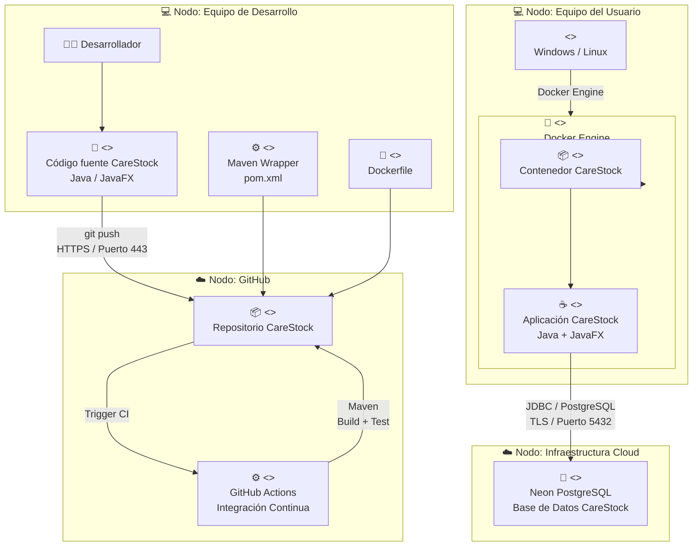

cat > docs/architecture/DIAGRAMA_DESPLIEGUE.md <<'EOF'
# 🚀 CareStock - Diagrama de Despliegue

## 1. Descripción

El diagrama de despliegue de **CareStock** representa la infraestructura física y lógica necesaria para ejecutar el sistema de gestión de inventario farmacéutico.

CareStock está desarrollado en **Java con JavaFX**, utiliza **Maven** para la gestión y construcción del proyecto y se comunica mediante **JDBC** con una base de datos **PostgreSQL alojada en Neon**.

Como parte de la estrategia de despliegue, la aplicación se empaqueta mediante **Docker**, permitiendo contar con un entorno reproducible e independiente de la configuración particular del equipo donde se ejecute.

El código fuente se almacena en **GitHub** y los procesos de integración continua pueden ser ejecutados mediante **GitHub Actions**.

---

## 2. Diagrama de Despliegue



---

## 3. Nodos de Despliegue

### 3.1 Equipo de Desarrollo

Representa el computador utilizado por los integrantes del equipo para desarrollar y mantener CareStock.

En este nodo se encuentran herramientas como:

- Java.
- JavaFX.
- Maven.
- Git.
- Git Bash.
- Docker.
- IDE de desarrollo.

Los desarrolladores modifican el código fuente y posteriormente envían los cambios al repositorio remoto mediante Git.

---

### 3.2 GitHub

GitHub funciona como nodo externo para la gestión del código fuente y el ciclo de desarrollo del proyecto.

Permite realizar:

- Control de versiones.
- Gestión de ramas.
- Pull Requests.
- Issues y sub-issues.
- Revisiones de código.
- Integración continua mediante GitHub Actions.

La comunicación entre el equipo de desarrollo y GitHub se realiza mediante HTTPS.

---

### 3.3 Equipo del Usuario

Representa el dispositivo desde el cual se ejecuta CareStock.

El equipo puede utilizar un sistema operativo compatible y disponer de Docker Engine para proporcionar el entorno de ejecución de la aplicación.

---

### 3.4 Docker Engine

Docker constituye el entorno de ejecución encargado de crear y ejecutar el contenedor de CareStock.

Su utilización permite reducir las diferencias entre los ambientes de desarrollo y ejecución, proporcionando una configuración reproducible.

---

### 3.5 Contenedor CareStock

El contenedor incluye los elementos necesarios para ejecutar la aplicación.

Dentro del contenedor se despliega el artefacto correspondiente a CareStock desarrollado con Java y JavaFX.

---

### 3.6 Neon PostgreSQL

Neon proporciona el servicio administrado de PostgreSQL utilizado por CareStock para almacenar la información persistente del sistema.

Entre los datos gestionados se encuentran:

- Usuarios.
- Roles.
- Farmacias.
- Medicamentos.
- Lotes.
- Inventarios.
- Despachos.
- Preferencias.
- Información relacionada con las operaciones del sistema.

La conexión entre CareStock y PostgreSQL se realiza mediante JDBC utilizando una conexión cifrada mediante TLS.

---

## 4. Artefactos

| Artefacto | Nodo | Función |
|---|---|---|
| Código fuente Java | Equipo de desarrollo / GitHub | Implementación de CareStock |
| `pom.xml` | GitHub / Proyecto | Configuración Maven |
| Maven Wrapper | Proyecto | Construcción reproducible |
| `Dockerfile` | Proyecto | Definición de la imagen Docker |
| Imagen Docker | Docker Engine | Empaquetamiento de CareStock |
| Aplicación CareStock | Contenedor Docker | Sistema ejecutable |
| Scripts SQL | Proyecto / PostgreSQL | Definición y mantenimiento de la persistencia |

---

## 5. Comunicaciones

| Origen | Destino | Tecnología / Protocolo | Puerto |
|---|---|---|---|
| Equipo de desarrollo | GitHub | Git sobre HTTPS | 443 |
| GitHub | GitHub Actions | Integración continua | HTTPS |
| GitHub Actions | Proyecto CareStock | Maven Build / Test | N/A |
| Equipo del usuario | Docker | Docker Engine | Local |
| Aplicación CareStock | Neon PostgreSQL | JDBC / PostgreSQL sobre TLS | 5432 |

---

## 6. Configuración de Base de Datos

CareStock utiliza variables de entorno para establecer la conexión con PostgreSQL.

Las principales variables utilizadas son:

```text
DB_URL
DB_USER
DB_PASSWORD
```

La aplicación obtiene estos valores durante su ejecución y establece la comunicación con Neon mediante JDBC.

Las credenciales de acceso no deben almacenarse directamente dentro del código fuente ni publicarse en el repositorio.

---

## 7. Flujo de Despliegue

El flujo general de despliegue puede resumirse de la siguiente forma:

1. El desarrollador modifica el código de CareStock.
2. Los cambios son enviados al repositorio de GitHub mediante Git.
3. GitHub Actions ejecuta las verificaciones definidas para integración continua.
4. Maven compila y ejecuta las pruebas correspondientes.
5. Docker utiliza el `Dockerfile` para construir el entorno de ejecución.
6. CareStock se ejecuta dentro del contenedor.
7. La aplicación establece conexión con Neon PostgreSQL mediante JDBC.
8. PostgreSQL proporciona la persistencia necesaria para las operaciones del sistema.

---

## 8. Consideraciones de Diseño

La arquitectura de despliegue mantiene una separación entre:

- La aplicación.
- El entorno de ejecución.
- El repositorio de código.
- Los procesos de integración continua.
- La infraestructura de persistencia.

El uso de Docker facilita la portabilidad del sistema y permite mantener un entorno consistente entre los diferentes equipos.

La base de datos se mantiene desacoplada de la aplicación mediante el uso de PostgreSQL como servicio administrado en Neon.

Esta arquitectura evita incorporar componentes que actualmente no forman parte de CareStock, como Kubernetes, Redis, API Gateway o una arquitectura de microservicios.
EOF