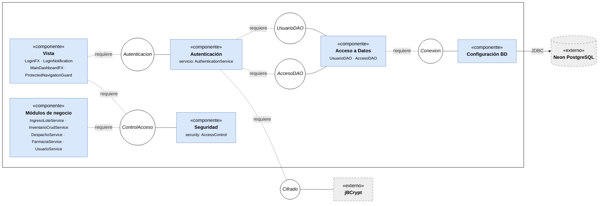

# Diagrama de Componentes — HU.51

**Proyecto:** CareStock
**Historia de usuario:** HU.51 — Inicio de sesión con autenticación y sesión activa del usuario (#286)
**Archivo editable:** [`Componentes_HU51_Inicio_Sesion.drawio`](./Componentes_HU51_Inicio_Sesion.drawio)

## Diagrama

Notación: el círculo con línea sólida es una interfaz provista y la línea punteada "requiere" es una interfaz requerida (el semicírculo del archivo draw.io). Los elementos grises con borde punteado son externos al sistema.

## Explicación

El diagrama muestra cómo se organiza CareStock en módulos para soportar el inicio de sesión de la HU.51.

**Componentes.**
- **Vista:** pantallas JavaFX del login y del dashboard, junto con la protección de navegación para usuarios sin sesión.
- **Autenticación:** valida las credenciales del usuario.
- **Acceso a Datos:** consulta los usuarios y registra los intentos de acceso.
- **Seguridad:** verifica que exista una sesión válida y que el rol tenga permiso.
- **Configuración BD:** administra la conexión con la base de datos.
- **Módulos de negocio:** servicios de lotes, inventario, despacho, farmacias y usuarios, que dependen del control de acceso para operar.

**Interfaces provistas.** Autenticación ofrece `Autenticacion`; Acceso a Datos ofrece `UsuarioDAO` y `AccesoDAO`; Seguridad ofrece `ControlAcceso`; Configuración BD ofrece `Conexion`.

**Interfaces requeridas.** La Vista necesita `Autenticacion` y `ControlAcceso`. Autenticación necesita `UsuarioDAO`, `AccesoDAO` y `Cifrado`. Los Módulos de negocio necesitan `ControlAcceso`. Acceso a Datos necesita `Conexion`.

**Servicios externos.** **jBCrypt** es la librería que compara la contraseña ingresada con el hash almacenado, de modo que las contraseñas nunca se guardan en texto plano. **Neon PostgreSQL** es la base de datos en la nube con las tablas de usuarios, roles y registro de accesos; Configuración BD se conecta a ella por JDBC.

Cada componente depende de los demás solo a través de interfaces, así que un módulo puede cambiar su implementación sin afectar al resto.
