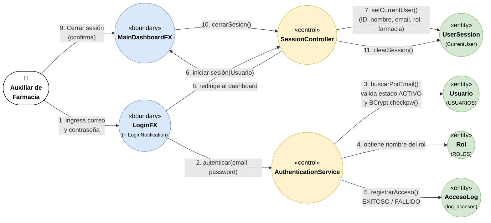

# Diagrama de Análisis (ECB) — HU.51

**Proyecto:** CareStock
**Historia de usuario:** HU.51 — Inicio de sesión con autenticación y sesión activa del usuario (#286)
**Archivo editable:** [`ECB_HU51_Inicio_Sesion.drawio`](./ECB_HU51_Inicio_Sesion.drawio)

## Diagrama

## Explicación

El diagrama modela el flujo de la HU.51 separando la interfaz, la lógica y los datos.

**Límites (Boundary).** Son las pantallas con las que interactúa el Auxiliar de Farmacia. `LoginFX` recibe el correo y la contraseña y, mediante `LoginNotification`, muestra el mensaje genérico *"Usuario o contraseña incorrectos"* sin revelar si el usuario existe. `MainDashboardFX` es la pantalla principal después del ingreso y ofrece la opción de cerrar sesión.

**Control.** `AuthenticationService` contiene la lógica de autenticación: busca el usuario por correo, verifica que su estado sea `ACTIVO`, compara la contraseña con el hash usando BCrypt y registra cada intento como exitoso o fallido. `SessionController` gestiona la sesión: la crea tras un ingreso válido y la destruye al cerrar sesión.

**Entidades (Entity).** `Usuario` y `Rol` corresponden a las tablas `USUARIOS` y `ROLES` de PostgreSQL. `AccesoLog` es la tabla `log_accesos`, que deja la trazabilidad de los intentos de ingreso. `UserSession` guarda en memoria al usuario activo (ID, nombre, email, rol y farmacia) para que todas las operaciones posteriores queden vinculadas a él.

**Flujo.** Los pasos 1 a 8 cubren la autenticación y la captura de la sesión activa. Los pasos 9 a 11 cubren el cierre de sesión. Se respetan las reglas ECB: el actor solo interactúa con límites, los límites se comunican con controles y solo los controles acceden a las entidades.
