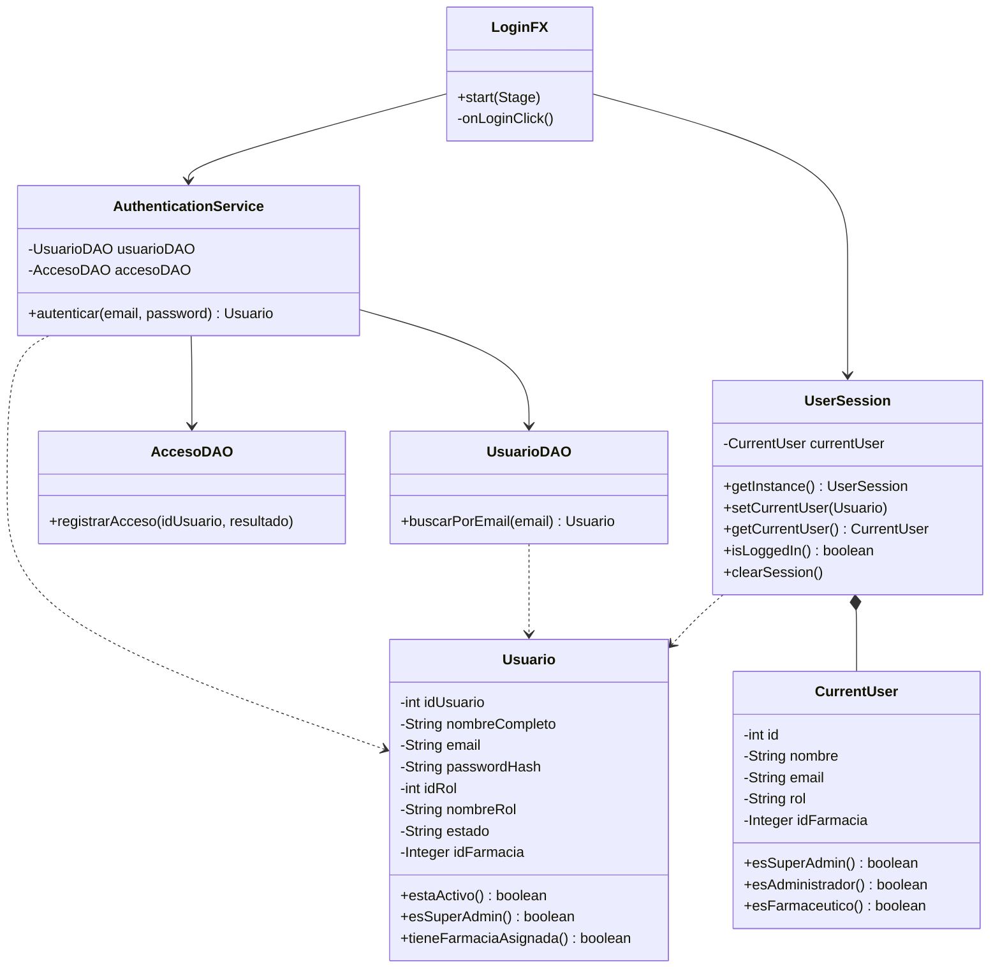

# Diagrama de Clases - HU-51 (Login)

```mermaid
classDiagram
    class LoginFX {
      +start(Stage)
      -onLoginClick()
    }
    class AuthenticationService {
      -UsuarioDAO usuarioDAO
      -AccesoDAO accesoDAO
      +autenticar(email, password) Usuario
    }
    class UsuarioDAO {
      +buscarPorEmail(email) Usuario
    }
    class AccesoDAO {
      +registrarAcceso(idUsuario, resultado)
    }
    class Usuario {
      -int idUsuario
      -String nombreCompleto
      -String email
      -String passwordHash
      -int idRol
      -String nombreRol
      -String estado
      -Integer idFarmacia
      +estaActivo() boolean
      +esSuperAdmin() boolean
      +tieneFarmaciaAsignada() boolean
    }
    class UserSession {
      -CurrentUser currentUser
      +getInstance() UserSession
      +setCurrentUser(Usuario)
      +getCurrentUser() CurrentUser
      +isLoggedIn() boolean
      +clearSession()
    }
    class CurrentUser {
      -int id
      -String nombre
      -String email
      -String rol
      -Integer idFarmacia
      +esSuperAdmin() boolean
      +esAdministrador() boolean
      +esFarmaceutico() boolean
    }
    LoginFX --> AuthenticationService
    LoginFX --> UserSession
    AuthenticationService --> UsuarioDAO
    AuthenticationService --> AccesoDAO
    AuthenticationService ..> Usuario
    UsuarioDAO ..> Usuario
    UserSession *-- CurrentUser
    UserSession ..> Usuario
```
