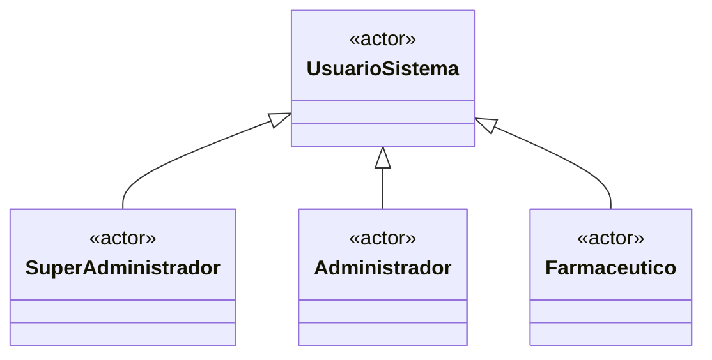
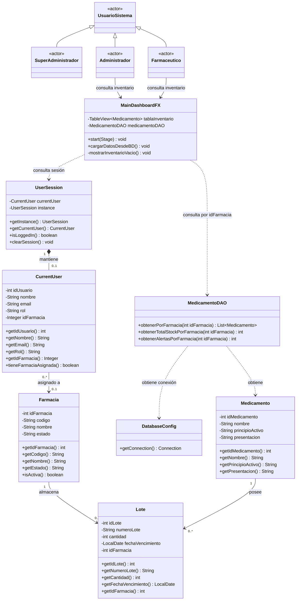

# HU-67 — Diagrama de Clases
## 1. Actores involucrados

En CareStock se identifican los siguientes roles de usuario:

- Super Administrador.
- Administrador.
- Farmacéutico.

Para la HU-67 los actores directamente involucrados son **Administrador** y **Farmacéutico**, debido a que ambos realizan operaciones dentro del contexto de una farmacia asignada.

El **Super Administrador** se representa como parte de la estructura general de actores del sistema, pero no participa directamente en el flujo definido para esta historia de usuario.



> La generalización anterior representa conceptualmente los diferentes roles que interactúan con CareStock.
>
> No implica necesariamente la existencia de clases Java independientes para `SuperAdministrador`, `Administrador` y `Farmaceutico`.
>
> En la implementación actual, el rol del usuario se mantiene como parte de la información del usuario autenticado.

---

## 2. Diagrama de clases de la HU-67

El siguiente diagrama representa los actores y las clases que colaboran para realizar el filtrado automático del inventario según la farmacia asignada al usuario autenticado.



---

## 3. Descripción general del diseño

La HU-67 se encuentra orientada al contexto de la farmacia asociada al usuario autenticado.

Los actores **Administrador** y **Farmacéutico** interactúan con el `MainDashboardFX` para consultar la información del inventario.

El Dashboard no determina manualmente qué farmacia debe visualizarse. En su lugar, consulta la sesión activa mediante `UserSession`.

`UserSession` mantiene una referencia al objeto `CurrentUser`, el cual contiene los datos principales del usuario autenticado, incluyendo:

- Identificador del usuario.
- Nombre.
- Correo electrónico.
- Rol.
- Identificador de la farmacia asignada.

El atributo:

```java
idFarmacia
```

actúa como contexto de seguridad y segmentación de los datos.

Este identificador es utilizado por `MedicamentoDAO` para recuperar únicamente los registros relacionados con la farmacia correspondiente al usuario autenticado. Todos estos diagramas pueden cambiar en un futuro ya que el sistema Carestock se esta modificando para que tenga implementado interfaces.

---

## 4. Flujo de interacción de la HU-67

El flujo conceptual de la historia de usuario es el siguiente:

```text
Administrador / Farmacéutico
            │
            ▼
      MainDashboardFX
            │
            ▼
        UserSession
            │
            ▼
       CurrentUser
            │
            ▼
        idFarmacia
            │
            ▼
      MedicamentoDAO
            │
            ▼
      DatabaseConfig
            │
            ▼
     PostgreSQL / Neon
```

El flujo puede resumirse en los siguientes pasos:

1. El usuario inicia sesión en CareStock.

2. El sistema almacena la información del usuario autenticado en `UserSession`.

3. `UserSession` mantiene una instancia de `CurrentUser`.

4. `CurrentUser` contiene el identificador de la farmacia asignada al usuario.

5. El usuario accede al Dashboard.

6. `MainDashboardFX` consulta la sesión activa.

7. Se obtiene el `idFarmacia` correspondiente al usuario autenticado.

8. El Dashboard solicita a `MedicamentoDAO` la información correspondiente a dicha farmacia.

9. `MedicamentoDAO` obtiene una conexión a PostgreSQL mediante `DatabaseConfig`.

10. La consulta restringe los resultados utilizando el identificador de farmacia.

11. El Dashboard presenta únicamente el inventario correspondiente a la farmacia del usuario.

---

## 5. Filtrado por farmacia

El identificador de farmacia obtenido desde el usuario autenticado se utiliza como parámetro de consulta.

Conceptualmente, el filtrado corresponde a una condición como:

```sql
WHERE id_farmacia = ?
```

El parámetro `?` es reemplazado mediante la consulta preparada por el `idFarmacia` obtenido desde el contexto de sesión.

Ejemplo conceptual:

```java
CurrentUser usuario = UserSession.getInstance().getCurrentUser();

Integer idFarmacia = usuario.getIdFarmacia();

List<Medicamento> medicamentos =
        medicamentoDAO.obtenerPorFarmacia(idFarmacia);
```

De esta forma, la selección de la farmacia no depende de una elección manual realizada desde la interfaz.

La farmacia utilizada para consultar el inventario corresponde directamente a la farmacia asignada al usuario autenticado.

---

## 6. Relaciones principales

### 6.1. UsuarioSistema — Administrador / Farmacéutico / SuperAdministrador

Se utiliza una relación conceptual de **generalización**.

`UsuarioSistema` representa de manera general a los usuarios que pueden interactuar con CareStock.

Los roles especializados son:

- `SuperAdministrador`.
- `Administrador`.
- `Farmaceutico`.

Esta representación corresponde al diseño conceptual y no significa necesariamente que exista una jerarquía de herencia equivalente en el código Java.

---

### 6.2. Administrador — MainDashboardFX

Relación de **interacción**.

El Administrador utiliza el Dashboard para consultar y gestionar información relacionada con la farmacia que tiene asignada.

Para la HU-67, la interacción relevante corresponde a la visualización del inventario filtrado automáticamente.

---

### 6.3. Farmacéutico — MainDashboardFX

Relación de **interacción**.

El Farmacéutico consulta el inventario correspondiente a su farmacia desde el Dashboard.

Al igual que el Administrador, no selecciona manualmente la farmacia que desea consultar.

---

### 6.4. UserSession — CurrentUser

Relación de **composición**.

`UserSession` mantiene el contexto del usuario autenticado durante la sesión activa.

Mientras existe una sesión autenticada, puede existir un objeto `CurrentUser` asociado.

```text
UserSession
     ◆
     │
     ▼
CurrentUser
```

Al limpiar o finalizar la sesión, la referencia al usuario autenticado también se elimina del contexto de sesión.

---

### 6.5. CurrentUser — Farmacia

Relación de **asociación**.

`CurrentUser` contiene el identificador de la farmacia asociada al usuario.

Un usuario operativo puede tener asignada una farmacia, mientras que una farmacia puede estar relacionada con múltiples usuarios.

Conceptualmente:

```text
CurrentUser
     │
     │ idFarmacia
     ▼
  Farmacia
```

El sistema utiliza esta relación para establecer el contexto de los datos que puede consultar el usuario.

---

### 6.6. MainDashboardFX — UserSession

Relación de **dependencia**.

`MainDashboardFX` consulta `UserSession` para determinar:

- Si existe una sesión activa.
- Qué usuario está autenticado.
- Qué farmacia tiene asignada.

El Dashboard no almacena de manera independiente la identidad del usuario.

---

### 6.7. MainDashboardFX — MedicamentoDAO

Relación de **dependencia**.

El Dashboard solicita la información del inventario mediante `MedicamentoDAO`.

El identificador de la farmacia obtenido desde la sesión se utiliza como parámetro para restringir la consulta.

Conceptualmente:

```java
medicamentoDAO.obtenerPorFarmacia(idFarmacia);
```

---

### 6.8. MedicamentoDAO — DatabaseConfig

Relación de **dependencia**.

`MedicamentoDAO` utiliza `DatabaseConfig` para obtener una conexión JDBC hacia la base de datos PostgreSQL alojada en Neon.

Conceptualmente:

```java
Connection connection = DatabaseConfig.getConnection();
```

---

### 6.9. MedicamentoDAO — Medicamento

Relación de **dependencia**.

El DAO consulta los registros almacenados en la base de datos y construye objetos de tipo `Medicamento` a partir de los resultados obtenidos.

---

### 6.10. Medicamento — Lote

Relación de **asociación uno a muchos**.

Un medicamento puede estar asociado con cero o múltiples lotes.

```text
Medicamento 1 ───── 0..* Lote
```

Los lotes representan existencias concretas de un medicamento.

---

### 6.11. Farmacia — Lote

Relación de **asociación uno a muchos**.

Una farmacia puede contener múltiples lotes.

```text
Farmacia 1 ───── 0..* Lote
```

Cada lote pertenece al contexto de una farmacia determinada.

Esta relación permite determinar físicamente a qué farmacia pertenece una existencia de inventario.

---

## 7. Responsabilidad de los actores

Los actores no acceden directamente a las clases responsables de persistencia.

Por lo tanto, no se establecen asociaciones directas como:

```text
Administrador ──X──> MedicamentoDAO
Farmacéutico ──X──> DatabaseConfig
Administrador ──X──> UserSession
Farmacéutico ──X──> Farmacia
```

Los actores interactúan con el sistema a través del Dashboard.

Las demás clases colaboran internamente para resolver la solicitud.

La interacción correcta se representa como:

```text
Administrador
      │
      └──────────┐
                 ▼
          MainDashboardFX
                 │
                 ├───────────────► UserSession
                 │                    │
                 │                    ▼
                 │               CurrentUser
                 │                    │
                 │                    ▼
                 │                 Farmacia
                 │
                 ▼
          MedicamentoDAO
                 │
                 ▼
          DatabaseConfig


Farmacéutico
      │
      └──────────► MainDashboardFX
```

---

## 8. Responsabilidad del Super Administrador

El `SuperAdministrador` se incluye dentro del modelo conceptual general de actores de CareStock.

Sin embargo, no se conecta directamente con el flujo principal de la HU-67 debido a que esta historia está orientada al filtrado de información para usuarios que trabajan dentro del contexto de una farmacia asignada.

Por esta razón, en el diagrama:

```text
SuperAdministrador
```

forma parte de la jerarquía de actores, pero no presenta una relación directa con `MainDashboardFX` para esta historia de usuario.

---

## 9. Regla de negocio representada

La regla principal implementada por la HU-67 es:

> Un Administrador o Farmacéutico autenticado únicamente debe visualizar el inventario correspondiente a la farmacia que tiene asignada.

Por lo tanto, el identificador de farmacia no debe ser seleccionado manualmente por el usuario para realizar la consulta.

El sistema debe obtenerlo automáticamente desde el contexto de sesión:

```text
Usuario autenticado
        │
        ▼
   CurrentUser
        │
        ▼
    idFarmacia
        │
        ▼
Consulta de inventario
```

---

## 10. Consideraciones de seguridad

El filtrado por farmacia no debe implementarse únicamente como un mecanismo visual.

Ocultar registros en la interfaz no garantiza por sí mismo el aislamiento de información.

La restricción debe aplicarse también durante la consulta de datos.

Por esta razón, el identificador de farmacia debe ser incluido en las consultas correspondientes:

```sql
SELECT ...
FROM ...
WHERE id_farmacia = ?;
```

De esta forma, la base de datos únicamente devuelve los registros correspondientes al contexto de farmacia del usuario autenticado.

Esto evita que la interfaz reciba información perteneciente a otras farmacias.
