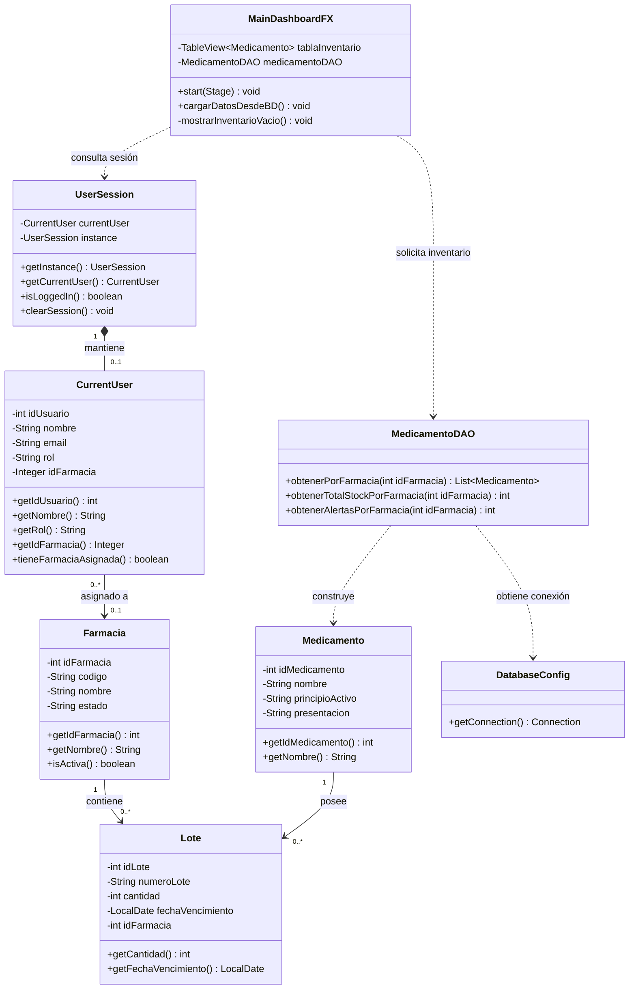

# HU-67 — Diagrama de Clases

## Objetivo

Representar las clases involucradas en el filtrado automático del inventario según la farmacia asignada al usuario autenticado.

## Relaciones principales

**UserSession — CurrentUser**

Existe una relación de composición porque la sesión mantiene el contexto del usuario autenticado.

**CurrentUser — Farmacia**

El usuario puede tener una farmacia asignada. El `idFarmacia` del usuario determina los datos a los cuales puede acceder.

**MainDashboardFX — UserSession**

La vista obtiene el contexto del usuario activo antes de consultar el inventario.

**MainDashboardFX — MedicamentoDAO**

La vista/controlador solicita los registros correspondientes a la farmacia activa.

**MedicamentoDAO — DatabaseConfig**

El DAO obtiene una conexión JDBC para realizar la consulta en PostgreSQL.

**Farmacia — Lote**

Una farmacia puede almacenar cero o múltiples lotes.

**Medicamento — Lote**

Un medicamento puede estar asociado a múltiples lotes.
