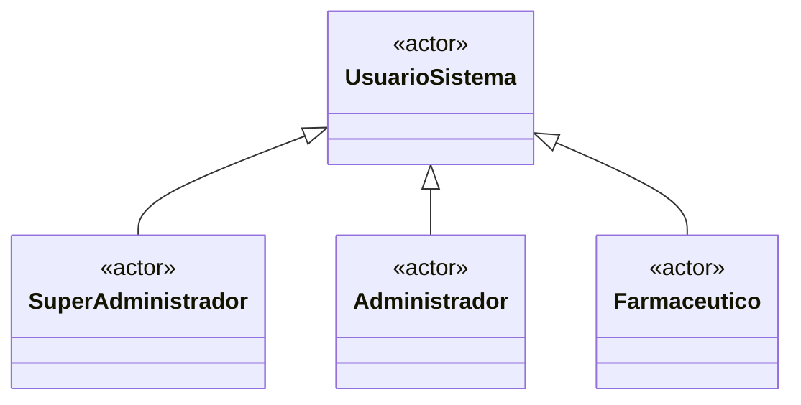
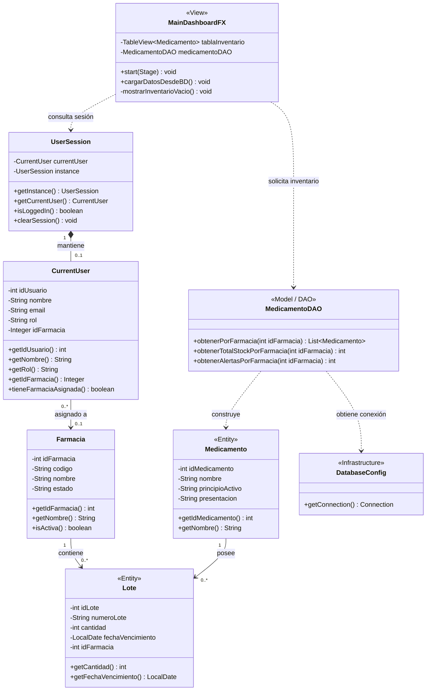

# HU-67 — Diagrama de Clases

## Objetivo

Representar los actores conceptuales y las clases involucradas en el filtrado automático del inventario según la farmacia asignada al usuario autenticado.

---

## 1. Actores involucrados

En CareStock se identifican los siguientes roles de usuario:

- Super Administrador.
- Administrador.
- Farmacéutico.

Para la HU-67 los actores directamente involucrados son **Administrador** y **Farmacéutico**, debido a que ambos operan dentro del contexto de una farmacia asignada.



> Esta generalización representa los roles que interactúan con CareStock.
> No implica necesariamente la existencia de clases Java independientes para cada rol.
> En la implementación actual, el rol se mantiene dentro del contexto del usuario autenticado.

---

## 2. Diagrama de Clases de la HU-67



---

## 3. Relación entre los actores y las clases

Los actores no acceden directamente a las clases de persistencia.

El flujo correspondiente a la HU-67 es:

```text
Administrador / Farmacéutico
            ↓
      MainDashboardFX
            ↓
        UserSession
            ↓
       CurrentUser
            ↓
       idFarmacia
            ↓
      MedicamentoDAO
            ↓
     DatabaseConfig
            ↓
     PostgreSQL / Neon
```

El `idFarmacia` almacenado en el usuario autenticado actúa como contexto para restringir los registros visibles.

La consulta de inventario utiliza este valor para aplicar:

```sql
WHERE id_farmacia = ?
```

De esta forma, el usuario únicamente puede visualizar el inventario correspondiente a su farmacia.

---

## 4. Relaciones principales

### UserSession — CurrentUser

Relación de composición.

`UserSession` mantiene el contexto del usuario autenticado durante la sesión.

### CurrentUser — Farmacia

Relación de asociación.

El usuario puede tener una farmacia asignada mediante `idFarmacia`.

### MainDashboardFX — UserSession

Relación de dependencia.

La vista consulta la sesión para determinar el contexto del usuario autenticado.

### MainDashboardFX — MedicamentoDAO

Relación de dependencia.

La vista solicita los datos del inventario utilizando el identificador de la farmacia activa.

### MedicamentoDAO — DatabaseConfig

Relación de dependencia.

El DAO utiliza `DatabaseConfig` para establecer la conexión JDBC con PostgreSQL.

### Farmacia — Lote

Una farmacia puede contener cero o múltiples lotes.

### Medicamento — Lote

Un medicamento puede estar relacionado con cero o múltiples lotes.
