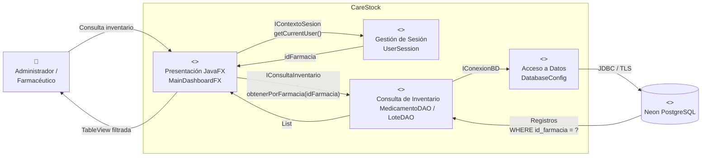

# HU-67 — Diagrama de Componentes

## Objetivo

Representar los componentes involucrados en la consulta y visualización segregada del inventario por farmacia.



## Interfaces

### IContextoSesion

Provista por el componente de gestión de sesión.

Permite obtener:

```text
CurrentUser
idUsuario
rol
idFarmacia
```

### IConsultaInventario

Provista por el componente de persistencia del inventario.

Operación principal:

```text
obtenerPorFarmacia(idFarmacia)
```

### IConexionBD

Utilizada por los DAO para establecer comunicación con PostgreSQL mediante JDBC.

## Responsabilidad por componente

### Presentación JavaFX

Responsable de mostrar la tabla de inventario y manejar el estado vacío.

### Gestión de Sesión

Mantiene el usuario autenticado y su contexto de farmacia.

### Consulta de Inventario

Ejecuta las consultas de lectura restringidas por `id_farmacia`.

### Acceso a Datos

Administra la conexión JDBC con la base de datos.

### Neon PostgreSQL

Almacena la información persistente correspondiente a usuarios, farmacias, medicamentos, lotes e inventario.
