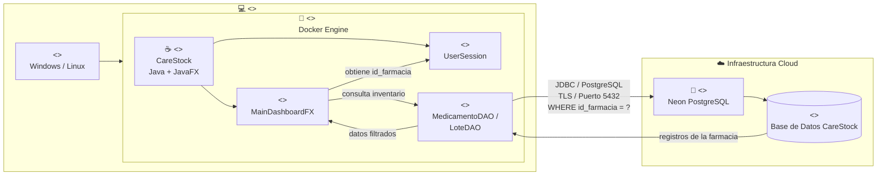

# HU-67 — Diagrama de Despliegue

## Objetivo

Representar la infraestructura utilizada para ejecutar la funcionalidad de filtrado de inventario por farmacia.



## Nodos

### Equipo del Usuario

Dispositivo desde el cual el Administrador o Farmacéutico ejecuta CareStock.

### Docker Engine

Entorno de ejecución utilizado para contenerizar CareStock.

### Aplicación CareStock

Aplicación Java/JavaFX que contiene la interfaz, contexto de sesión y acceso a persistencia.

### Neon PostgreSQL

Servicio PostgreSQL administrado en la nube que contiene la información persistente del sistema.

## Comunicación

La aplicación establece una conexión con Neon mediante:

```text
JDBC
PostgreSQL
TLS
Puerto 5432
```

La consulta correspondiente a HU-67 debe incluir como condición obligatoria:

```sql
WHERE id_farmacia = ?
```

El parámetro enviado corresponde al identificador de farmacia almacenado en el contexto del usuario autenticado.
