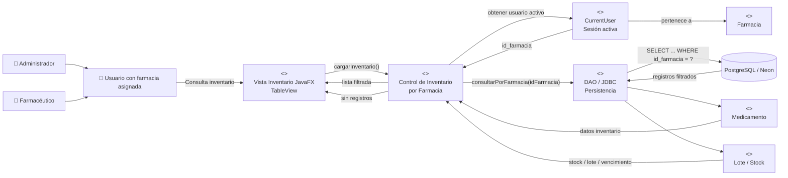

# HU-67 — Diagrama de Análisis ECB

## Historia de Usuario

**Como** usuario del sistema  
**Quiero** que la tabla principal de inventario muestre únicamente los productos de mi sede  
**Para** garantizar la segregación de datos y evitar alteraciones accidentales en el stock de otras farmacias.

## Actores

Los actores involucrados directamente en esta historia son:

- Administrador.
- Farmacéutico.

Ambos representan especializaciones conceptuales de un usuario del sistema que posee una farmacia asignada.

## Diagrama ECB



## Responsabilidades ECB

### Boundary — Vista Inventario JavaFX

Representa la interfaz mediante la cual el usuario visualiza el inventario.

Debe:

- cargar automáticamente el inventario al abrir la vista;
- mostrar únicamente registros pertenecientes a la farmacia activa;
- mostrar el mensaje `Inventario vacío para esta sede` cuando no existan registros.

### Control — Control de Inventario por Farmacia

Coordina la ejecución del caso de uso.

Debe:

1. obtener el usuario de la sesión activa;
2. recuperar su `id_farmacia`;
3. validar que exista una farmacia asignada;
4. enviar el identificador al componente de persistencia;
5. recibir los registros;
6. actualizar la vista.

### Entity — CurrentUser

Representa el contexto del usuario autenticado.

Proporciona, entre otros:

- identificador del usuario;
- rol;
- identificador de farmacia.

### Entity — Farmacia

Representa la sede a la cual pertenece el usuario y delimita el inventario que puede consultar.

### Entity — Medicamento / Lote

Representan los datos de inventario recuperados para la farmacia activa.

### Boundary de Persistencia — DAO / JDBC

Representa el punto de comunicación entre la lógica de CareStock y PostgreSQL.

La consulta debe incluir obligatoriamente:

```sql
WHERE id_farmacia = ?
```
