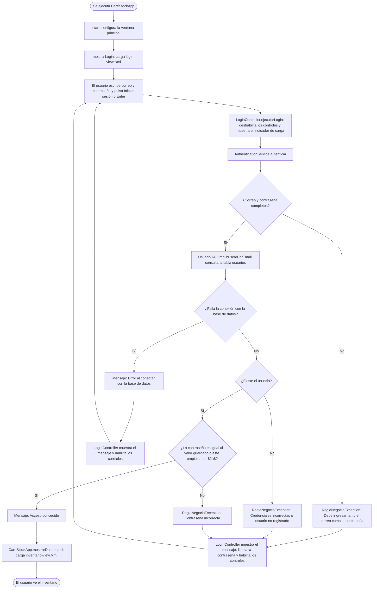

# HU-81 — Puntos de entrada y flujo de arranque e inicio de sesión

**Historia de Usuario:** HU-81  
**Código analizado:** `src/CareStock`, commit `0d85f9c` (merge del PR #624)  
**Fecha:** 10 de octubre de 2026

## 1. Puntos de entrada de la aplicación

El módulo tiene tres clases con método `main`. Las clases se citan con su nombre simple; todas están en el paquete `org.example.carestock`.

| Clase | Cómo se ejecuta | Qué hace | ¿Pasa por el inicio de sesión? |
|---|---|---|---|
| `CareStockApp` | Es la clase principal configurada en el `javafx-maven-plugin` del `pom.xml` (`./mvnw javafx:run`), y la que usa el `Dockerfile` del módulo | Abre la ventana, muestra primero `login-view.fxml` y solo después de autenticarse pasa a `inventario-view.fxml` | Sí. Es el único recorrido que muestra el inventario, y solo lo hace tras el inicio de sesión |
| `Launcher` | Tiene su propio `main`; ni el `pom.xml` ni el `Dockerfile` lo usan | Lanza `HelloApplication`, que muestra la ventana de ejemplo `hello-view.fxml` con un botón y un texto de bienvenida | No aplica. No muestra el inicio de sesión ni datos del inventario |
| `PruebaConexion` | Tiene su propio `main` y se ejecuta por consola | Consulta `LoteDAOImpl.listarTodos()` y escribe en la consola los lotes registrados en la base de datos | No. No pide ni valida credenciales de usuario |

---

## 2. Flujo de arranque e inicio de sesión

Diagrama de actividades del recorrido por `CareStockApp`, desde que se ejecuta hasta que se ve el inventario o un mensaje de error.

Notas sobre el diagrama:

- La decisión sobre la contraseña refleja el código actual: la condición acepta el acceso cuando el valor guardado empieza por `$2a$`, el prefijo de bcrypt. El detalle de seguridad está en `HU-80-arquitectura-por-capas.md`, sección 5.2.
- El estado del usuario (`ACTIVO`, `INACTIVO` o `BLOQUEADO`) no se evalúa en este recorrido.
- Si la autenticación falla, el usuario permanece en la pantalla de inicio de sesión y puede volver a intentarlo.
