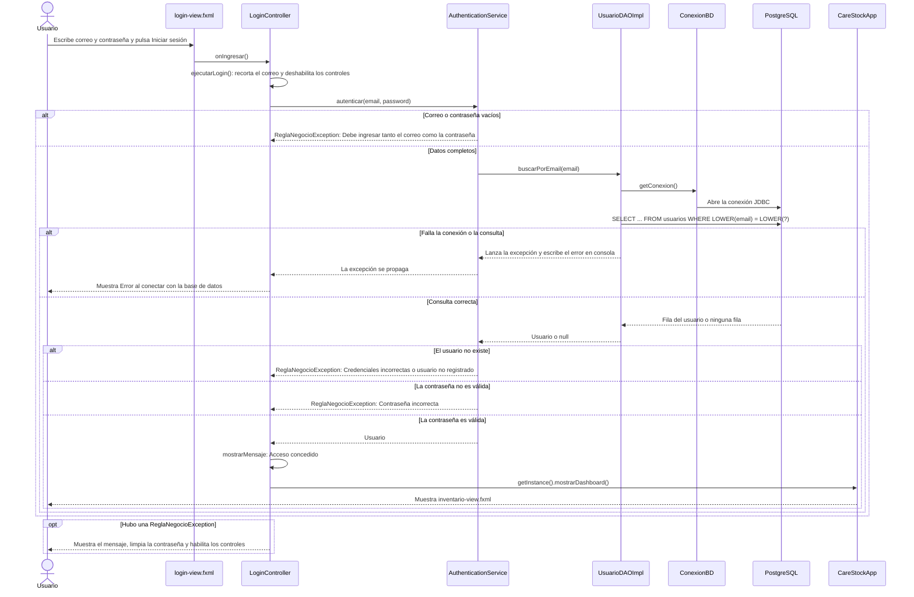

# HU-81 — Diagrama de secuencia de la autenticación

**Historia de Usuario:** HU-81  
**Código analizado:** `src/CareStock`, commit `0d85f9c` (merge del PR #624)  
**Fecha:** 10 de octubre de 2026

## 1. Participantes

Todas las clases están en el paquete `org.example.carestock`.

| Participante | Clase o recurso | Capa |
|---|---|---|
| Vista | `login-view.fxml` | Vista (JavaFX) |
| Controlador | `LoginController` | Controlador |
| Servicio | `AuthenticationService` | Servicio |
| DAO | `UsuarioDAOImpl` | Acceso a datos |
| Conexión | `ConexionBD` | Configuración |
| Base de datos | PostgreSQL (Neon), tabla `usuarios` | Base de datos |
| Navegación | `CareStockApp` | Arranque y navegación |

---

## 2. Pasos del inicio de sesión

1. El usuario escribe su correo y su contraseña en `login-view.fxml` y pulsa el botón de iniciar sesión (o la tecla Enter en el campo de contraseña).
2. `LoginController.onIngresar()` llama a `ejecutarLogin()`, que lee y recorta el correo, deshabilita los controles y muestra el indicador de carga.
3. El controlador llama a `AuthenticationService.autenticar(email, password)`.
4. El servicio rechaza los campos vacíos con una `ReglaNegocioException`. Si están completos, pide el usuario a `UsuarioDAOImpl.buscarPorEmail`.
5. El DAO abre una conexión con `ConexionBD.getConexion()` y ejecuta un `SELECT` sobre la tabla `usuarios`, comparando el correo sin distinguir mayúsculas.
6. El servicio revisa el resultado: si no hay usuario o la contraseña no es válida, lanza una `ReglaNegocioException` con el mensaje correspondiente.
7. Si todo es válido, el controlador muestra el mensaje de bienvenida y llama a `CareStockApp.getInstance().mostrarDashboard()`, que carga `inventario-view.fxml`.
8. Si hubo una regla incumplida, el controlador muestra el mensaje, limpia la contraseña y habilita de nuevo los controles. Si falló la conexión, muestra el error de conexión.

---

## 3. Diagrama de secuencia

---

## 4. Notas sobre el comportamiento actual

- La rama "La contraseña es válida" refleja el código actual: `AuthenticationService` concede el acceso cuando el valor guardado es igual al escrito o cuando empieza por el prefijo `$2a$` de bcrypt. El detalle de seguridad está en `HU-80-arquitectura-por-capas.md`, sección 5.2.
- `UsuarioDAOImpl` lee el rol y el estado del usuario, pero no se usan: el rol se guarda como el número `id_rol` y el estado solo se imprime en consola.
- El `Usuario` autenticado no se conserva. `LoginController` solo usa su nombre para el mensaje de bienvenida.
- `UsuarioDAOImpl` escribe en consola el correo consultado y el estado del usuario cada vez que busca un usuario.
