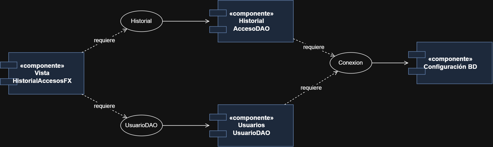

# Diagrama de Componentes — HU.49

**Proyecto:** CareStock
**Historia de usuario:** HU.49 — Consultar el historial de inicios de sesión de los usuarios (#284)

## Diagrama

## Explicación

El diagrama muestra la organización modular de CareStock para soportar la consulta del historial de accesos.

**Componentes.**
- **Vista:** pantalla HistorialAccesosFX.
- **Historial:** AccesoDAO, encargado de consultar el historial.
- **Usuarios:** UsuarioDAO, encargado de listar usuarios.
- **Configuración BD:** gestiona la conexión con la base de datos.

**Interfaces provistas.** Historial ofrece Historial; Usuarios ofrece UsuarioDAO; Configuración BD ofrece Conexion.

**Interfaces requeridas.** Vista requiere Historial y UsuarioDAO. Historial y Usuarios requieren Conexion.

> La base de datos no se incluye porque es un artefacto de despliegue, y se modela en el Diagrama de Despliegue.
